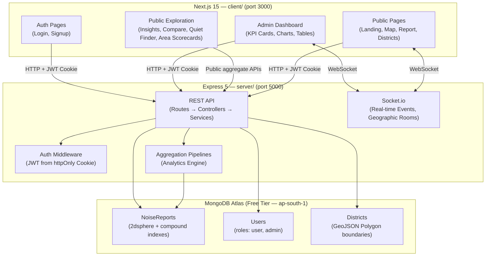

# ShorLahore — Noise Pollution Crowdsource Mapper

> **Urban planning meets crowdsourcing.** Residents report noise levels by type, intensity, time, and location. Over time, the platform builds a living noise map of a city — animated heatmaps, district breakdowns, complaint trends — helping renters, city planners, and residents make informed decisions.

---

## Feasibility Assessment — Lahore, Pakistan

> [!IMPORTANT]
> **This project is HIGHLY feasible and uniquely positioned for Lahore.** Here's why:

### Why Lahore is the Perfect City for This

| Factor | Detail |
|---|---|
| **Real Problem** | Lahore noise levels regularly hit **86.5 dB(A)** on Ferozepur Road & Ali Road — far exceeding the Punjab EPD limit of 45–55 dB(A). Auto-rickshaws, pressure horns, generators, and construction are constant. |
| **No Existing Solution** | There is **no dedicated crowdsource noise mapping app** for Lahore or Pakistan. The government's SANS app and 1129 helpline handle generic environmental complaints — not interactive noise maps. |
| **Rich Diversity of Noise Sources** | Lahore has distinct noise profiles: Walled City congestion, DHA generator hum, Gulberg commercial buzz, Johar Town construction, Mall Road traffic, Anarkali bazaar chaos. This creates visually interesting heatmaps. |
| **Civic Tech Gap** | Code for Pakistan runs mapathons, academia publishes noise studies, but nobody has built a **live, interactive, crowdsourced** tool. You'd be first. |
| **OpenStreetMap Coverage** | Lahore has excellent OSM coverage — roads, buildings, neighborhoods are well-mapped. MapLibre tiles will look great. |
| **MongoDB Geospatial** | Lahore's dense urban grid (~1,700 km²) is perfect for `2dsphere` geospatial queries and radius-based heatmaps. |
| **Portfolio Standout** | A civic tech project solving a real local problem with GPU-accelerated animated heatmaps is orders of magnitude more impressive than another CRUD app. |

### What Makes It Stand Out in a Portfolio

1. **Animated 24-hour heatmap** — drag a time slider and watch noise hotspots shift from construction zones (daytime) to nightlife districts (night). This alone is a demo showstopper.
2. **Real geospatial engineering** — MongoDB `2dsphere` indexes, `$geoNear` aggregation pipelines, GeoJSON polygon district matching. Not toy CRUD.
3. **Real-time architecture** — Socket.io rooms for geographic filtering, live report feeds, instant map updates.
4. **Data visualization depth** — District × Hour intensity matrix, animated KPI counters, radar charts, stacked area charts. Dashboards that look enterprise-grade.
5. **Local relevance** — You can literally use this to explain your neighborhood's noise problem. Interviewers remember stories.

---

## Tech Stack (Verified Versions — June 2026)

> [!IMPORTANT]
> Re-check package versions before installation. This plan records the intended major versions and architecture, but `latest` tags can change. Pin exact versions in `package-lock.json` after the first successful install and avoid relying on `latest` in production docs or CI.

| Layer | Technology | Version | Why |
|---|---|---|---|
| Frontend | **Next.js** (App Router, TypeScript) | `15.x` (latest stable) | Server Components, Turbopack, React 19, SSR for SEO |
| Maps | **MapLibre GL JS** + **react-map-gl/maplibre** | MapLibre `5.x`, react-map-gl `7.x` | Free, no API key, WebGL2, excellent Pakistan/Lahore OSM coverage |
| Heatmaps | **deck.gl** (`@deck.gl/mapbox` + `@deck.gl/aggregation-layers`) | `9.x` | GPU-accelerated HeatmapLayer, `MapboxOverlay` + `useControl` integration |
| Charts | **Recharts** `3.x` + **Nivo** (`@nivo/heatmap`) `0.99.x` | React 19 compatible | Flexible, beautiful, well-documented |
| Icons | **Lucide React** | pinned current stable | Clean, consistent icon set |
| Styling | **Vanilla CSS** (CSS Modules) | — | Full control, no dependency bloat, works perfectly with Next.js |
| Backend | **Express** (TypeScript) | `5.2.x` (stable, production-recommended) | Native async error handling, mature ecosystem |
| Database | **MongoDB** via **Mongoose** | MongoDB `7+`, Mongoose `8.x` | Geospatial `2dsphere` indexes, aggregation pipelines, time-series |
| Auth | **Custom JWT** (httpOnly cookies) | pinned current stable | Secure, clean frontend/backend separation |
| Validation | **Zod** | `3.x` | Runtime + TypeScript type inference from same schema |
| Real-time | **Socket.io** | `4.x` | Rooms for geographic filtering, bidirectional events, reconnection |
| Language | **TypeScript** | `5.x` | Type safety across the full stack |

> [!NOTE]
> **Map Tiles (Free, No API Key Required):**
> - Primary: `https://tiles.openfreemap.org/styles/dark` (OpenFreeMap dark)
> - Fallback: `https://basemaps.cartocdn.com/gl/dark-matter-gl-style/style.json` (CartoCDN Dark Matter)
> - Lahore center coordinates: `[74.3507, 31.5580]` (longitude, latitude — GeoJSON format)
> - Default zoom: `12`

> [!NOTE]
> **MongoDB Atlas Free Tier (M0):**
> - 512 MB storage (includes data + indexes) — sufficient for ~50,000+ noise reports
> - Supports `2dsphere` geospatial indexes ✅
> - 500 concurrent connections, 100 ops/sec
> - Select **AWS / ap-south-1 (Mumbai)** for lowest latency from Lahore

---

## Project Structure — Single Monorepo

The entire project lives in a single GitHub repository (`shor-lahore`) inside `c:\Users\hasee\Downloads\NoisePollutionMapper\`:

```
shor-lahore/                       ← Single GitHub Repository
├── server/                        ← Express 5 backend
├── client/                        ← Next.js 15 frontend
├── implementation_plan.md         ← This file
├── README.md                      ← Root README showcasing the full stack
├── .gitignore                     ← Root gitignore (node_modules, dist, .next, .env)
└── package.json                   ← Root package.json (workspace scripts using concurrently)
```

#### Root `package.json` (Workspace Orchestrator)

```json
{
  "name": "shor-lahore",
  "version": "1.0.0",
  "private": true,
  "description": "Crowdsourced noise pollution mapping platform for Lahore, Pakistan",
  "scripts": {
    "dev": "concurrently -n server,client -c blue,green \"npm run dev --prefix server\" \"npm run dev --prefix client\"",
    "dev:server": "npm run dev --prefix server",
    "dev:client": "npm run dev --prefix client",
    "build": "npm run build --prefix server && npm run build --prefix client",
    "build:server": "npm run build --prefix server",
    "build:client": "npm run build --prefix client",
    "seed": "npm run seed --prefix server",
    "install:all": "npm install && cd server && npm install && cd ../client && npm install"
  },
  "devDependencies": {
    "concurrently": "^9.1.0"
  }
}
```

> [!TIP]
> **Running the full stack:** A single `npm run dev` from the root launches both the Express server (port 5000) and the Next.js client (port 3000) side-by-side in one terminal with color-coded output.
>
> **First-time setup:** Run `npm run install:all` from the root to install dependencies for root, server, and client in one command.

---

## Architecture Overview



---

## Public Exploration Layer Update

This update expands the normal user experience beyond viewing the map, browsing areas, and submitting reports. Admin analytics remain protected under `/api/analytics`; public exploration uses separate aggregate-only routes under `/api/public`.

### Backend Additions

New backend files:

```text
server/src/controllers/public.controller.ts
server/src/routes/public.routes.ts
server/src/services/public.service.ts
server/src/validators/public.validator.ts
server/src/controllers/__tests__/public-exploration.test.ts
```

New public-safe endpoints:

| Method | Path | Description |
|---|---|---|
| `GET` | `/api/public/insights?period=7d\|30d\|90d\|1y\|all` | Public city-wide KPIs, trends, noise mix, hourly profile, area ranking, area-hour matrix, and recent reports |
| `GET` | `/api/public/areas/:id/scorecard?period=7d\|30d\|90d\|1y\|all` | Public area scorecard with quiet score, peak hour, quietest hour, top source, Lahore comparison, charts, and recent reports |
| `GET` | `/api/public/compare?districtIds=id1,id2,id3&period=...` | Compare 2-3 mapped areas, or default to the top two highest-report areas |
| `GET` | `/api/public/quiet-finder?period=...&timeWindow=any\|morning\|afternoon\|evening\|night&avoidType=NoiseType&maxIntensity=1-10` | Rank areas by expected quietness for selected filters |
| `GET` | `/api/users/me/impact` | Authenticated current-user contribution summary |

Public endpoints must:
- Use active reports for public analytics.
- Return aggregate or public-safe report data only.
- Avoid exposing user emails, admin moderation state, inactive-user controls, or admin-only data.
- Keep `/api/analytics/*` protected by `protect` + `restrictTo('admin')`.

### Frontend Additions

New public routes:

```text
/insights
/compare
/quiet-finder
/me
```

Updated route:

```text
/districts/[id]
```

Public UX additions:
- `/insights`: city-wide public analytics using existing chart components.
- `/compare`: selectable area comparison with quiet score, average intensity, top source, peak hour, quietest hour, and mini hourly bars.
- `/quiet-finder`: recommendation-style ranked areas based on time window, avoided noise source, and max intensity.
- `/me`: authenticated user impact page with reports, upvotes, areas contributed, reputation, report mix, and recent submissions.
- `/districts/[id]`: upgraded from a report list into a public area scorecard.
- Navbar: add public exploration links, show `My Impact` only for authenticated users, and show `Admin` only for admins.

New frontend shared types include `AreaScorecard`, `PublicInsights`, `AreaComparison`, `QuietFinderResponse`, and `MyImpact`.

### Verification Status For This Update

Verified locally:

```bash
npm.cmd run test --prefix server
npm.cmd run build --prefix client
npm.cmd run build --prefix server
```

The server build initially surfaced a TypeScript inference issue in `public.service.ts`; it was fixed by explicitly typing hourly summaries before final build verification.

---

## Component 1: Backend — Express API Server

### 1.1 Project Initialization

#### [NEW] `server/` — Full Directory Tree

```
server/
├── src/
│   ├── config/
│   │   ├── db.ts                    # MongoDB connection with retry logic
│   │   ├── env.ts                   # Zod-validated environment variables
│   │   └── socket.ts               # Socket.io server setup + room logic
│   ├── controllers/
│   │   ├── auth.controller.ts       # register, login, logout, getMe
│   │   ├── report.controller.ts     # CRUD + geo queries + upvote
│   │   ├── analytics.controller.ts  # All /analytics/* aggregation endpoints
│   │   ├── district.controller.ts   # list, create, getReportsInDistrict
│   │   └── user.controller.ts       # admin user management
│   ├── middleware/
│   │   ├── auth.middleware.ts       # protect (any logged-in), restrictTo('admin')
│   │   ├── validate.middleware.ts   # Generic Zod schema validator
│   │   ├── rateLimiter.middleware.ts # express-rate-limit config
│   │   └── error.middleware.ts      # Global error handler (ApiError aware)
│   ├── models/
│   │   ├── User.model.ts            # User schema + password hashing hooks
│   │   ├── NoiseReport.model.ts     # Report schema + geospatial indexes
│   │   └── District.model.ts        # District schema + 2dsphere boundary
│   ├── routes/
│   │   ├── auth.routes.ts
│   │   ├── report.routes.ts
│   │   ├── analytics.routes.ts
│   │   ├── district.routes.ts
│   │   └── user.routes.ts
│   ├── services/
│   │   ├── auth.service.ts          # Business logic for auth
│   │   ├── report.service.ts        # Business logic for reports
│   │   └── analytics.service.ts     # All MongoDB aggregation pipelines
│   ├── sockets/
│   │   └── noiseSocket.ts          # Socket.io event handlers + room mgmt
│   ├── utils/
│   │   ├── jwt.ts                   # signToken, verifyToken helpers
│   │   ├── password.ts             # hashPassword, comparePassword (bcryptjs)
│   │   ├── ApiError.ts             # Custom error class with statusCode
│   │   └── catchAsync.ts           # Async error wrapper for controllers
│   ├── validators/
│   │   ├── auth.validator.ts        # Zod schemas: registerSchema, loginSchema
│   │   ├── report.validator.ts      # Zod schemas: createReportSchema, etc.
│   │   └── query.validator.ts       # Zod schemas: pagination, geo filters
│   ├── types/
│   │   └── index.ts                 # Shared TypeScript interfaces & enums
│   ├── app.ts                       # Express app configuration (middleware stack)
│   └── server.ts                    # HTTP server bootstrap + Socket.io attach
├── .env.example
├── tsconfig.json
├── package.json
└── nodemon.json
```

#### `package.json` Dependencies (exact)

```json
{
  "name": "shor-lahore-server",
  "version": "1.0.0",
  "type": "module",
  "scripts": {
    "dev": "nodemon",
    "build": "tsc",
    "start": "node dist/server.js",
    "seed": "tsx src/scripts/seed.ts"
  },
  "dependencies": {
    "express": "^5.2.0",
    "mongoose": "^8.0.0",
    "socket.io": "^4.8.0",
    "jsonwebtoken": "^9.0.0",
    "bcryptjs": "^2.4.3",
    "zod": "^3.23.0",
    "cors": "^2.8.5",
    "helmet": "^8.0.0",
    "express-rate-limit": "^7.5.0",
    "cookie-parser": "^1.4.7",
    "dotenv": "^16.4.0",
    "morgan": "^1.10.0"
  },
  "devDependencies": {
    "typescript": "^5.6.0",
    "@types/express": "^5.0.0",
    "@types/jsonwebtoken": "^9.0.0",
    "@types/bcryptjs": "^2.4.0",
    "@types/cors": "^2.8.0",
    "@types/cookie-parser": "^1.4.0",
    "@types/morgan": "^1.9.0",
    "nodemon": "^3.1.0",
    "tsx": "^4.19.0"
  }
}
```

#### `tsconfig.json`

```json
{
  "compilerOptions": {
    "target": "ES2022",
    "module": "Node16",
    "moduleResolution": "Node16",
    "lib": ["ES2022"],
    "outDir": "./dist",
    "rootDir": "./src",
    "strict": true,
    "esModuleInterop": true,
    "skipLibCheck": true,
    "forceConsistentCasingInFileNames": true,
    "resolveJsonModule": true,
    "declaration": true,
    "declarationMap": true,
    "sourceMap": true,
    "noUnusedLocals": true,
    "noUnusedParameters": true,
    "noImplicitReturns": true,
    "noFallthroughCasesInSwitch": true
  },
  "include": ["src/**/*"],
  "exclude": ["node_modules", "dist"]
}
```

#### `nodemon.json`

```json
{
  "watch": ["src"],
  "ext": "ts,json",
  "exec": "tsx src/server.ts"
}
```

#### `.env.example`

```env
# Server
PORT=5000
NODE_ENV=development

# MongoDB
MONGODB_URI=mongodb+srv://<username>:<password>@cluster0.xxxxx.mongodb.net/shorlahore?retryWrites=true&w=majority

# JWT
JWT_SECRET=your-super-secret-jwt-key-change-this-in-production
JWT_EXPIRES_IN=7d

# CORS
CLIENT_URL=http://localhost:3000

# Rate Limiting
RATE_LIMIT_WINDOW_MS=900000
RATE_LIMIT_MAX=100
```

---

### 1.2 Configuration Files — Full Implementation Detail

#### `src/config/env.ts` — Zod-validated environment

```typescript
import { z } from 'zod';
import dotenv from 'dotenv';

dotenv.config();

const envSchema = z.object({
  PORT: z.string().default('5000').transform(Number),
  NODE_ENV: z.enum(['development', 'production', 'test']).default('development'),
  MONGODB_URI: z.string().url('MONGODB_URI must be a valid connection string'),
  JWT_SECRET: z.string().min(32, 'JWT_SECRET must be at least 32 characters'),
  JWT_EXPIRES_IN: z.string().default('7d'),
  CLIENT_URL: z.string().url().default('http://localhost:3000'),
  RATE_LIMIT_WINDOW_MS: z.string().default('900000').transform(Number),
  RATE_LIMIT_MAX: z.string().default('100').transform(Number),
});

export const env = envSchema.parse(process.env);
```

#### `src/config/db.ts` — MongoDB connection

```typescript
import mongoose from 'mongoose';
import { env } from './env.js';

export const connectDB = async (): Promise<void> => {
  try {
    const conn = await mongoose.connect(env.MONGODB_URI, {
      // Mongoose 8 defaults are good — no need for useNewUrlParser etc.
    });
    console.log(`✅ MongoDB connected: ${conn.connection.host}`);
  } catch (error) {
    console.error('❌ MongoDB connection error:', error);
    process.exit(1);
  }

  mongoose.connection.on('error', (err) => {
    console.error('MongoDB runtime error:', err);
  });
};
```

#### `src/config/socket.ts` — Socket.io server

```typescript
import { Server as HttpServer } from 'http';
import { Server as SocketServer } from 'socket.io';
import { env } from './env.js';

let io: SocketServer;

export const initSocket = (httpServer: HttpServer): SocketServer => {
  io = new SocketServer(httpServer, {
    cors: {
      origin: env.CLIENT_URL,
      credentials: true,
    },
    pingInterval: 25000,
    pingTimeout: 60000,
  });

  io.on('connection', (socket) => {
    console.log(`🔌 Client connected: ${socket.id}`);

    // Client joins a geographic area room (bounding box hash)
    socket.on('join-area', (bounds: { north: number; south: number; east: number; west: number }) => {
      const roomName = `area_${bounds.south.toFixed(2)}_${bounds.west.toFixed(2)}_${bounds.north.toFixed(2)}_${bounds.east.toFixed(2)}`;
      socket.join(roomName);
      console.log(`📍 ${socket.id} joined room: ${roomName}`);
    });

    socket.on('leave-area', (bounds: { north: number; south: number; east: number; west: number }) => {
      const roomName = `area_${bounds.south.toFixed(2)}_${bounds.west.toFixed(2)}_${bounds.north.toFixed(2)}_${bounds.east.toFixed(2)}`;
      socket.leave(roomName);
    });

    // Client joins the admin dashboard room for live feed
    socket.on('join-dashboard', () => {
      socket.join('dashboard');
    });

    socket.on('disconnect', () => {
      console.log(`🔌 Client disconnected: ${socket.id}`);
    });
  });

  return io;
};

export const getIO = (): SocketServer => {
  if (!io) throw new Error('Socket.io not initialized');
  return io;
};
```

---

### 1.3 Shared Types — `src/types/index.ts`

```typescript
// ============ ENUMS ============

export const NOISE_TYPES = [
  'construction',
  'traffic',
  'nightlife',
  'neighbors',
  'industrial',
  'animals',
  'sirens',
  'religious',     // Loudspeakers — relevant in Lahore
  'generators',    // Very common in Pakistan due to load-shedding
  'horns',         // Pressure horns — huge Lahore problem
  'music',
  'other',
] as const;

export type NoiseType = typeof NOISE_TYPES[number];

export const REPORT_STATUSES = ['active', 'resolved', 'flagged'] as const;
export type ReportStatus = typeof REPORT_STATUSES[number];

export const USER_ROLES = ['user', 'admin'] as const;
export type UserRole = typeof USER_ROLES[number];

// ============ INTERFACES ============

export interface GeoJSONPoint {
  type: 'Point';
  coordinates: [number, number]; // [longitude, latitude]
}

export interface GeoJSONPolygon {
  type: 'Polygon';
  coordinates: [number, number][][]; // Array of linear rings
}

export interface IUser {
  _id: string;
  name: string;
  email: string;
  password: string;
  role: UserRole;
  avatar?: string;
  reportsCount: number;
  reputation: number;
  location?: GeoJSONPoint;
  isActive: boolean;
  createdAt: Date;
  updatedAt: Date;
}

export interface INoiseReport {
  _id: string;
  user: string | IUser;
  location: GeoJSONPoint;
  noiseType: NoiseType;
  intensity: number; // 1-10
  description?: string;
  district?: string;
  tags: string[];
  mediaUrl?: string;
  status: ReportStatus;
  createdAt: Date;
  occurredAt: Date;
  upvotes: number;
  upvotedBy: string[];
}

export interface IDistrict {
  _id: string;
  name: string;
  city: string;
  boundary: GeoJSONPolygon;
  avgNoiseLevel: number;
  totalReports: number;
  createdAt: Date;
}

// ============ API RESPONSE TYPES ============

export interface PaginatedResponse<T> {
  success: true;
  data: T[];
  pagination: {
    page: number;
    limit: number;
    total: number;
    pages: number;
  };
}

export interface AnalyticsOverview {
  totalReports: number;
  totalReportsChange: number; // % change from previous period
  activeToday: number;
  avgIntensity: number;
  avgIntensityChange: number;
  topNoiseType: { type: NoiseType; count: number };
  totalUsers: number;
  totalDistricts: number;
}

export interface TrendDataPoint {
  date: string; // ISO date string
  count: number;
}

export interface NoiseTypeBreakdown {
  type: NoiseType;
  count: number;
  percentage: number;
}

export interface HourlyDistribution {
  hour: number; // 0-23
  count: number;
  avgIntensity: number;
}

export interface DistrictStats {
  district: string;
  totalReports: number;
  avgIntensity: number;
  topNoiseType: NoiseType;
}

export interface HeatmapGridCell {
  district: string;
  hour: number;
  avgIntensity: number;
}

export interface HeatmapDataPoint {
  coordinates: [number, number]; // [lng, lat]
  weight: number; // intensity 1-10
}
```

---

### 1.4 Data Models — Full Mongoose Schemas

#### `src/models/User.model.ts`

```typescript
import mongoose, { Schema, Document, Model } from 'mongoose';
import { IUser, USER_ROLES } from '../types/index.js';

export interface IUserDocument extends Omit<IUser, '_id'>, Document {
  comparePassword(candidatePassword: string): Promise<boolean>;
}

const userSchema = new Schema<IUserDocument>(
  {
    name: {
      type: String,
      required: [true, 'Name is required'],
      trim: true,
      minlength: [2, 'Name must be at least 2 characters'],
      maxlength: [50, 'Name cannot exceed 50 characters'],
    },
    email: {
      type: String,
      required: [true, 'Email is required'],
      unique: true,
      lowercase: true,
      trim: true,
      match: [/^\S+@\S+\.\S+$/, 'Please provide a valid email'],
    },
    password: {
      type: String,
      required: [true, 'Password is required'],
      minlength: [8, 'Password must be at least 8 characters'],
      select: false, // Never return password by default
    },
    role: {
      type: String,
      enum: USER_ROLES,
      default: 'user',
    },
    avatar: {
      type: String,
      default: undefined,
    },
    reportsCount: {
      type: Number,
      default: 0,
      min: 0,
    },
    reputation: {
      type: Number,
      default: 0,
      min: 0,
    },
    location: {
      type: {
        type: String,
        enum: ['Point'],
      },
      coordinates: {
        type: [Number], // [longitude, latitude]
      },
    },
    isActive: {
      type: Boolean,
      default: true,
    },
  },
  {
    timestamps: true,
    toJSON: {
      transform(_doc, ret) {
        delete ret.password;
        delete ret.__v;
        return ret;
      },
    },
  }
);

// Index for geospatial queries on user location (optional)
userSchema.index({ location: '2dsphere' }, { sparse: true });
// Index for email lookups
userSchema.index({ email: 1 });

// Pre-save hook: hash password (imported from utils)
import { hashPassword } from '../utils/password.js';

userSchema.pre('save', async function (next) {
  if (!this.isModified('password')) return next();
  this.password = await hashPassword(this.password);
  next();
});

// Instance method: compare password
import { comparePassword } from '../utils/password.js';

userSchema.methods.comparePassword = async function (candidatePassword: string): Promise<boolean> {
  return comparePassword(candidatePassword, this.password);
};

export const User: Model<IUserDocument> = mongoose.model<IUserDocument>('User', userSchema);
```

#### `src/models/NoiseReport.model.ts`

```typescript
import mongoose, { Schema, Document, Model } from 'mongoose';
import { INoiseReport, NOISE_TYPES, REPORT_STATUSES } from '../types/index.js';

export interface INoiseReportDocument extends Omit<INoiseReport, '_id' | 'user'>, Document {
  user: mongoose.Types.ObjectId;
  upvotedBy: mongoose.Types.ObjectId[];
}

const noiseReportSchema = new Schema<INoiseReportDocument>(
  {
    user: {
      type: Schema.Types.ObjectId,
      ref: 'User',
      required: [true, 'Report must belong to a user'],
    },
    location: {
      type: {
        type: String,
        enum: ['Point'],
        required: true,
        default: 'Point',
      },
      coordinates: {
        type: [Number], // [longitude, latitude]
        required: [true, 'Location coordinates are required'],
        validate: {
          validator: function (coords: number[]) {
            return (
              coords.length === 2 &&
              coords[0] >= -180 && coords[0] <= 180 && // longitude
              coords[1] >= -90 && coords[1] <= 90      // latitude
            );
          },
          message: 'Invalid coordinates. Must be [longitude, latitude] with valid ranges.',
        },
      },
    },
    noiseType: {
      type: String,
      required: [true, 'Noise type is required'],
      enum: {
        values: NOISE_TYPES,
        message: 'Invalid noise type: {VALUE}',
      },
    },
    intensity: {
      type: Number,
      required: [true, 'Intensity level is required'],
      min: [1, 'Intensity must be at least 1'],
      max: [10, 'Intensity cannot exceed 10'],
    },
    description: {
      type: String,
      maxlength: [500, 'Description cannot exceed 500 characters'],
      trim: true,
    },
    district: {
      type: String,
      default: undefined,
      // Auto-populated by a pre-save hook or post-creation service call
    },
    tags: {
      type: [String],
      default: [],
      validate: {
        validator: function (tags: string[]) {
          return tags.length <= 10;
        },
        message: 'Cannot have more than 10 tags',
      },
    },
    mediaUrl: {
      type: String,
      default: undefined,
    },
    status: {
      type: String,
      enum: REPORT_STATUSES,
      default: 'active',
    },
    occurredAt: {
      type: Date,
      required: [true, 'Occurrence time is required'],
      validate: {
        validator: function (date: Date) {
          return date <= new Date(); // Can't report future noise
        },
        message: 'Occurrence time cannot be in the future',
      },
    },
    upvotes: {
      type: Number,
      default: 0,
      min: 0,
    },
    upvotedBy: {
      type: [Schema.Types.ObjectId],
      default: [],
      select: false, // Don't return this array by default
    },
  },
  {
    timestamps: true, // createdAt and updatedAt
    toJSON: {
      transform(_doc, ret) {
        delete ret.__v;
        return ret;
      },
    },
  }
);

// ============ INDEXES ============
// Primary geospatial index — enables $geoNear, $geoWithin queries
noiseReportSchema.index({ location: '2dsphere' });

// Time-based sorting — most recent first
noiseReportSchema.index({ createdAt: -1 });

// Type + time compound — filtered queries by noise type
noiseReportSchema.index({ noiseType: 1, createdAt: -1 });

// District analytics — reports per district over time
noiseReportSchema.index({ district: 1, createdAt: -1 });

// Time-of-day analysis — which hours are noisiest
noiseReportSchema.index({ occurredAt: 1 });

// Status filtering — admin report management
noiseReportSchema.index({ status: 1 });

// Compound for heatmap queries — location + time + intensity
noiseReportSchema.index({ 'location.coordinates': 1, occurredAt: 1, intensity: 1 });

export const NoiseReport: Model<INoiseReportDocument> = mongoose.model<INoiseReportDocument>(
  'NoiseReport',
  noiseReportSchema
);
```

#### `src/models/District.model.ts`

```typescript
import mongoose, { Schema, Document, Model } from 'mongoose';
import { IDistrict } from '../types/index.js';

export interface IDistrictDocument extends Omit<IDistrict, '_id'>, Document {}

const districtSchema = new Schema<IDistrictDocument>(
  {
    name: {
      type: String,
      required: [true, 'District name is required'],
      unique: true,
      trim: true,
    },
    city: {
      type: String,
      required: [true, 'City is required'],
      default: 'Lahore',
      trim: true,
    },
    boundary: {
      type: {
        type: String,
        enum: ['Polygon'],
        required: true,
      },
      coordinates: {
        type: [[[Number]]], // Array of linear rings, each an array of [lng, lat] pairs
        required: true,
      },
    },
    avgNoiseLevel: {
      type: Number,
      default: 0,
      min: 0,
      max: 10,
    },
    totalReports: {
      type: Number,
      default: 0,
      min: 0,
    },
  },
  {
    timestamps: true,
  }
);

// Geospatial index on polygon boundary — enables $geoIntersects point-in-polygon
districtSchema.index({ boundary: '2dsphere' });

export const District: Model<IDistrictDocument> = mongoose.model<IDistrictDocument>(
  'District',
  districtSchema
);
```

---

### 1.5 Utility Functions

#### `src/utils/ApiError.ts`

```typescript
export class ApiError extends Error {
  public statusCode: number;
  public isOperational: boolean;

  constructor(statusCode: number, message: string, isOperational = true) {
    super(message);
    this.statusCode = statusCode;
    this.isOperational = isOperational;
    Error.captureStackTrace(this, this.constructor);
  }

  static badRequest(message: string) { return new ApiError(400, message); }
  static unauthorized(message = 'Not authenticated') { return new ApiError(401, message); }
  static forbidden(message = 'Not authorized') { return new ApiError(403, message); }
  static notFound(message = 'Resource not found') { return new ApiError(404, message); }
  static conflict(message: string) { return new ApiError(409, message); }
  static tooMany(message = 'Too many requests') { return new ApiError(429, message); }
  static internal(message = 'Internal server error') { return new ApiError(500, message, false); }
}
```

#### `src/utils/catchAsync.ts`

> [!NOTE]
> Express 5 handles rejected async route handlers natively. Keep `catchAsync` only as a consistency helper for controller style, not because Express 5 requires it.

```typescript
import { Request, Response, NextFunction } from 'express';

type AsyncHandler = (req: Request, res: Response, next: NextFunction) => Promise<any>;

export const catchAsync = (fn: AsyncHandler) => {
  return (req: Request, res: Response, next: NextFunction) => {
    fn(req, res, next).catch(next);
  };
};
```

#### `src/utils/jwt.ts`

```typescript
import jwt from 'jsonwebtoken';
import { env } from '../config/env.js';

interface JwtPayload {
  userId: string;
  role: string;
}

export const signToken = (payload: JwtPayload): string => {
  return jwt.sign(payload, env.JWT_SECRET, {
    expiresIn: env.JWT_EXPIRES_IN,
  });
};

export const verifyToken = (token: string): JwtPayload => {
  return jwt.verify(token, env.JWT_SECRET) as JwtPayload;
};
```

#### `src/utils/password.ts`

```typescript
import bcrypt from 'bcryptjs';

const SALT_ROUNDS = 12;

export const hashPassword = async (password: string): Promise<string> => {
  return bcrypt.hash(password, SALT_ROUNDS);
};

export const comparePassword = async (candidate: string, hashed: string): Promise<boolean> => {
  return bcrypt.compare(candidate, hashed);
};
```

---

### 1.6 Middleware — Full Implementation

#### `src/middleware/auth.middleware.ts`

```typescript
import { Request, Response, NextFunction } from 'express';
import { verifyToken } from '../utils/jwt.js';
import { User } from '../models/User.model.js';
import { ApiError } from '../utils/ApiError.js';
import { UserRole } from '../types/index.js';

// Extend Express Request to include user
declare global {
  namespace Express {
    interface Request {
      user?: {
        _id: string;
        name: string;
        email: string;
        role: UserRole;
      };
    }
  }
}

/**
 * Protect routes — requires valid JWT in httpOnly cookie named "token"
 */
export const protect = async (req: Request, _res: Response, next: NextFunction) => {
  const token = req.cookies?.token;

  if (!token) {
    throw ApiError.unauthorized('Please log in to access this resource');
  }

  try {
    const decoded = verifyToken(token);
    const user = await User.findById(decoded.userId).select('name email role isActive');

    if (!user || !user.isActive) {
      throw ApiError.unauthorized('User no longer exists or is deactivated');
    }

    req.user = {
      _id: user._id.toString(),
      name: user.name,
      email: user.email,
      role: user.role as UserRole,
    };

    next();
  } catch (error) {
    if (error instanceof ApiError) throw error;
    throw ApiError.unauthorized('Invalid or expired token');
  }
};

/**
 * Restrict to specific roles — must be called AFTER protect
 */
export const restrictTo = (...roles: UserRole[]) => {
  return (req: Request, _res: Response, next: NextFunction) => {
    if (!req.user || !roles.includes(req.user.role)) {
      throw ApiError.forbidden('You do not have permission to perform this action');
    }
    next();
  };
};
```

#### `src/middleware/validate.middleware.ts`

```typescript
import { Request, Response, NextFunction } from 'express';
import { ZodSchema, ZodError } from 'zod';
import { ApiError } from '../utils/ApiError.js';

type RequestPart = 'body' | 'query' | 'params';

/**
 * Generic Zod validation middleware.
 * Usage: validate(createReportSchema, 'body')
 */
export const validate = (schema: ZodSchema, source: RequestPart = 'body') => {
  return (req: Request, _res: Response, next: NextFunction) => {
    try {
      const parsed = schema.parse(req[source]);
      req[source] = parsed; // Replace with parsed (coerced) values
      next();
    } catch (error) {
      if (error instanceof ZodError) {
        const messages = error.errors.map((e) => `${e.path.join('.')}: ${e.message}`).join(', ');
        throw ApiError.badRequest(`Validation error: ${messages}`);
      }
      next(error);
    }
  };
};
```

#### `src/middleware/rateLimiter.middleware.ts`

```typescript
import rateLimit from 'express-rate-limit';
import { env } from '../config/env.js';

export const globalLimiter = rateLimit({
  windowMs: env.RATE_LIMIT_WINDOW_MS, // 15 minutes
  max: env.RATE_LIMIT_MAX,            // 100 requests per window
  message: { success: false, message: 'Too many requests, please try again later' },
  standardHeaders: true,
  legacyHeaders: false,
});

export const authLimiter = rateLimit({
  windowMs: 15 * 60 * 1000, // 15 minutes
  max: 10,                   // 10 auth attempts per window
  message: { success: false, message: 'Too many login attempts, please try again later' },
  standardHeaders: true,
  legacyHeaders: false,
});

export const reportLimiter = rateLimit({
  windowMs: 60 * 60 * 1000, // 1 hour
  max: 30,                   // 30 reports per hour per IP
  message: { success: false, message: 'Report submission limit reached. Try again later.' },
  standardHeaders: true,
  legacyHeaders: false,
});
```

#### `src/middleware/error.middleware.ts`

```typescript
import { Request, Response, NextFunction } from 'express';
import { ApiError } from '../utils/ApiError.js';
import { env } from '../config/env.js';

export const errorHandler = (err: Error, _req: Request, res: Response, _next: NextFunction) => {
  let statusCode = 500;
  let message = 'Internal Server Error';

  if (err instanceof ApiError) {
    statusCode = err.statusCode;
    message = err.message;
  }

  // Mongoose duplicate key error
  if ((err as any).code === 11000) {
    statusCode = 409;
    const field = Object.keys((err as any).keyValue || {})[0];
    message = `Duplicate value for ${field}. This ${field} is already in use.`;
  }

  // Mongoose validation error
  if (err.name === 'ValidationError') {
    statusCode = 400;
    const errors = Object.values((err as any).errors).map((e: any) => e.message);
    message = `Validation Error: ${errors.join(', ')}`;
  }

  // Mongoose bad ObjectId
  if (err.name === 'CastError') {
    statusCode = 400;
    message = 'Invalid ID format';
  }

  res.status(statusCode).json({
    success: false,
    message,
    ...(env.NODE_ENV === 'development' && { stack: err.stack }),
  });
};
```

---

### 1.7 Zod Validators — `src/validators/`

#### `auth.validator.ts`

```typescript
import { z } from 'zod';

export const registerSchema = z.object({
  name: z.string().min(2).max(50).trim(),
  email: z.string().email().toLowerCase().trim(),
  password: z.string().min(8).max(128),
});

export const loginSchema = z.object({
  email: z.string().email().toLowerCase().trim(),
  password: z.string().min(1, 'Password is required'),
});
```

#### `report.validator.ts`

```typescript
import { z } from 'zod';
import { NOISE_TYPES, REPORT_STATUSES } from '../types/index.js';

export const createReportSchema = z.object({
  location: z.object({
    type: z.literal('Point').default('Point'),
    coordinates: z.tuple([
      z.number().min(-180).max(180), // longitude
      z.number().min(-90).max(90),   // latitude
    ]),
  }),
  noiseType: z.enum(NOISE_TYPES),
  intensity: z.number().int().min(1).max(10),
  description: z.string().max(500).optional(),
  tags: z.array(z.string().max(30)).max(10).default([]),
  mediaUrl: z.string().url().optional(),
  occurredAt: z.string().datetime().transform((s) => new Date(s)).refine(
    (d) => d <= new Date(),
    'Occurrence time cannot be in the future'
  ),
});

export const updateStatusSchema = z.object({
  status: z.enum(REPORT_STATUSES),
});

export const reportQuerySchema = z.object({
  page: z.string().default('1').transform(Number).pipe(z.number().int().min(1)),
  limit: z.string().default('20').transform(Number).pipe(z.number().int().min(1).max(100)),
  noiseType: z.enum(NOISE_TYPES).optional(),
  status: z.enum(REPORT_STATUSES).optional(),
  district: z.string().optional(),
  minIntensity: z.string().optional().transform((v) => (v ? Number(v) : undefined)),
  maxIntensity: z.string().optional().transform((v) => (v ? Number(v) : undefined)),
  startDate: z.string().datetime().optional(),
  endDate: z.string().datetime().optional(),
  sortBy: z.enum(['createdAt', 'intensity', 'upvotes']).default('createdAt'),
  sortOrder: z.enum(['asc', 'desc']).default('desc'),
});

export const nearbyQuerySchema = z.object({
  lng: z.string().transform(Number).pipe(z.number().min(-180).max(180)),
  lat: z.string().transform(Number).pipe(z.number().min(-90).max(90)),
  radius: z.string().default('1000').transform(Number).pipe(z.number().min(100).max(50000)), // meters
  limit: z.string().default('50').transform(Number).pipe(z.number().int().min(1).max(200)),
});

export const heatmapQuerySchema = z.object({
  // Bounding box
  swLng: z.string().transform(Number).pipe(z.number().min(-180).max(180)),
  swLat: z.string().transform(Number).pipe(z.number().min(-90).max(90)),
  neLng: z.string().transform(Number).pipe(z.number().min(-180).max(180)),
  neLat: z.string().transform(Number).pipe(z.number().min(-90).max(90)),
  // Optional time filter (hour of day, 0-23)
  hour: z.string().optional().transform((v) => (v !== undefined ? Number(v) : undefined)),
  // Optional noise type filter
  noiseType: z.enum(NOISE_TYPES).optional(),
});
```

#### `query.validator.ts`

```typescript
import { z } from 'zod';

export const paginationSchema = z.object({
  page: z.string().default('1').transform(Number).pipe(z.number().int().min(1)),
  limit: z.string().default('20').transform(Number).pipe(z.number().int().min(1).max(100)),
});

export const analyticsTimeRangeSchema = z.object({
  startDate: z.string().datetime().optional(),
  endDate: z.string().datetime().optional(),
  period: z.enum(['7d', '30d', '90d', '1y', 'all']).default('30d'),
  granularity: z.enum(['hourly', 'daily', 'weekly', 'monthly']).default('daily'),
});
```

---

### 1.8 API Endpoints — Complete Specification

#### Auth Routes (`/api/auth`)

| Method | Path | Controller | Middleware | Request Body/Query | Response |
|---|---|---|---|---|---|
| `POST` | `/register` | `register` | `validate(registerSchema)`, `authLimiter` | `{ name, email, password }` | `201 { success, data: { user }, token }` + sets `token` httpOnly cookie |
| `POST` | `/login` | `login` | `validate(loginSchema)`, `authLimiter` | `{ email, password }` | `200 { success, data: { user } }` + sets `token` httpOnly cookie |
| `POST` | `/logout` | `logout` | `protect` | — | `200 { success, message }` + clears cookie |
| `GET` | `/me` | `getMe` | `protect` | — | `200 { success, data: { user } }` |

**Cookie Settings:**
```typescript
const cookieOptions = {
  httpOnly: true,
  secure: env.NODE_ENV === 'production',
  sameSite: 'lax' as const,
  maxAge: 7 * 24 * 60 * 60 * 1000, // 7 days
  path: '/',
};
```

---

#### Noise Reports Routes (`/api/reports`)

| Method | Path | Controller | Middleware | Request | Response |
|---|---|---|---|---|---|
| `POST` | `/` | `createReport` | `protect`, `reportLimiter`, `validate(createReportSchema)` | Body: createReportSchema | `201 { success, data: { report } }` + emits Socket.io `new-report` |
| `GET` | `/` | `getReports` | `validate(reportQuerySchema, 'query')` | Query: reportQuerySchema | `200 { success, data, pagination }` |
| `GET` | `/:id` | `getReportById` | — | Params: `id` | `200 { success, data: { report } }` |
| `PATCH` | `/:id/upvote` | `upvoteReport` | `protect` | — | `200 { success, data: { upvotes } }` + emits `report-upvoted` |
| `PATCH` | `/:id/status` | `updateReportStatus` | `protect`, `restrictTo('admin')`, `validate(updateStatusSchema)` | Body: `{ status }` | `200 { success, data: { report } }` + emits `report-resolved` if resolved |
| `DELETE` | `/:id` | `deleteReport` | `protect`, `restrictTo('admin')` | — | `204 No Content` |
| `GET` | `/nearby` | `getNearbyReports` | `validate(nearbyQuerySchema, 'query')` | Query: `{ lng, lat, radius, limit }` | `200 { success, data: reports[] }` (sorted by distance) |
| `GET` | `/heatmap` | `getHeatmapData` | `validate(heatmapQuerySchema, 'query')` | Query: `{ swLng, swLat, neLng, neLat, hour?, noiseType? }` | `200 { success, data: HeatmapDataPoint[] }` |

**Key Implementation Details for `/heatmap`:**

The heatmap endpoint is the most performance-critical. It should:
1. Use `$geoWithin` with `$box` to filter by map viewport bounding box
2. If `hour` is specified, use `$expr` with `$hour` on `occurredAt` to filter by time-of-day
3. Return only `coordinates` and `weight` (intensity) — minimal payload
4. Use MongoDB's aggregation pipeline, NOT `.find()`, for maximum efficiency
5. Project only necessary fields to minimize network transfer

```typescript
// Pseudocode for the aggregation pipeline:
const pipeline = [
  {
    $match: {
      location: {
        $geoWithin: {
          $box: [[swLng, swLat], [neLng, neLat]],
        },
      },
      status: 'active',
      ...(hour !== undefined && {
        $expr: { $eq: [{ $hour: '$occurredAt' }, hour] },
      }),
      ...(noiseType && { noiseType }),
    },
  },
  {
    $project: {
      _id: 0,
      coordinates: '$location.coordinates',
      weight: '$intensity',
    },
  },
];
```

---

#### Analytics Routes (`/api/analytics`) — Admin Only

All analytics endpoints require `protect` + `restrictTo('admin')` middleware. All accept `analyticsTimeRangeSchema` query params.

| Method | Path | Controller | Description | Response Shape |
|---|---|---|---|---|
| `GET` | `/overview` | `getOverview` | KPI summary cards | `AnalyticsOverview` |
| `GET` | `/trends` | `getTrends` | Report count over time | `TrendDataPoint[]` |
| `GET` | `/by-type` | `getByType` | Breakdown by noise type | `NoiseTypeBreakdown[]` |
| `GET` | `/by-district` | `getByDistrict` | Stats per district | `DistrictStats[]` |
| `GET` | `/by-hour` | `getByHour` | 24-hour distribution | `HourlyDistribution[]` (24 items) |
| `GET` | `/heatmap-grid` | `getHeatmapGrid` | District × Hour matrix | `HeatmapGridCell[]` |
| `GET` | `/top-reporters` | `getTopReporters` | Most active users | `{ user, reportsCount, reputation }[]` |
| `GET` | `/recent` | `getRecentReports` | Latest 20 reports | `NoiseReport[]` (populated with user name) |

**Key Aggregation Pipeline for `/overview`:**

```typescript
// This runs multiple aggregations in parallel using Promise.all
const [
  totalReports,
  activeToday,
  avgIntensity,
  topNoiseType,
  previousPeriodTotal,
  previousAvgIntensity,
  totalUsers,
  totalDistricts,
] = await Promise.all([
  NoiseReport.countDocuments({ createdAt: { $gte: startDate } }),
  NoiseReport.countDocuments({
    createdAt: { $gte: new Date(new Date().setHours(0, 0, 0, 0)) },
    status: 'active',
  }),
  NoiseReport.aggregate([
    { $match: { createdAt: { $gte: startDate } } },
    { $group: { _id: null, avg: { $avg: '$intensity' } } },
  ]),
  NoiseReport.aggregate([
    { $match: { createdAt: { $gte: startDate } } },
    { $group: { _id: '$noiseType', count: { $sum: 1 } } },
    { $sort: { count: -1 } },
    { $limit: 1 },
  ]),
  // ... previous period queries for % change calculation
  NoiseReport.countDocuments({
    createdAt: { $gte: previousStartDate, $lt: startDate },
  }),
  NoiseReport.aggregate([
    { $match: { createdAt: { $gte: previousStartDate, $lt: startDate } } },
    { $group: { _id: null, avg: { $avg: '$intensity' } } },
  ]),
  User.countDocuments(),
  District.countDocuments(),
]);
```

**Key Aggregation Pipeline for `/heatmap-grid` (the showstopper):**

```typescript
// District × Hour intensity matrix
const pipeline = [
  { $match: { createdAt: { $gte: startDate }, district: { $ne: null } } },
  {
    $group: {
      _id: {
        district: '$district',
        hour: { $hour: '$occurredAt' },
      },
      avgIntensity: { $avg: '$intensity' },
      count: { $sum: 1 },
    },
  },
  {
    $project: {
      _id: 0,
      district: '$_id.district',
      hour: '$_id.hour',
      avgIntensity: { $round: ['$avgIntensity', 1] },
    },
  },
  { $sort: { district: 1, hour: 1 } },
];
```

---

#### District Routes (`/api/districts`)

| Method | Path | Controller | Middleware | Description |
|---|---|---|---|---|
| `GET` | `/` | `listDistricts` | — | All districts with stats |
| `POST` | `/` | `createDistrict` | `protect`, `restrictTo('admin')` | Create with GeoJSON boundary |
| `GET` | `/:id/reports` | `getDistrictReports` | `validate(paginationSchema, 'query')` | Reports within a district's polygon |

**Point-in-polygon query for auto-populating district on report creation:**

```typescript
// In report.service.ts → after creating a report
const district = await District.findOne({
  boundary: {
    $geoIntersects: {
      $geometry: {
        type: 'Point',
        coordinates: report.location.coordinates,
      },
    },
  },
});
if (district) {
  report.district = district.name;
  await report.save();
}
```

---

#### User Routes (`/api/users`) — Admin Only

| Method | Path | Controller | Middleware | Description |
|---|---|---|---|---|
| `GET` | `/` | `listUsers` | `protect`, `restrictTo('admin')`, `validate(paginationSchema, 'query')` | Paginated user list |
| `PATCH` | `/:id/role` | `updateRole` | `protect`, `restrictTo('admin')` | Toggle user/admin role |
| `PATCH` | `/:id/status` | `updateStatus` | `protect`, `restrictTo('admin')` | Activate/deactivate user |

---

### 1.9 Socket.io Events — Complete Contract

```
Server → Client Events:
  "new-report"        → { report: INoiseReport }                    // Broadcast to area rooms + dashboard
  "report-upvoted"    → { reportId: string, upvotes: number }       // Broadcast to all connected
  "report-resolved"   → { reportId: string, status: 'resolved' }    // Broadcast to area rooms + dashboard

Client → Server Events:
  "join-area"         → { north: number, south: number, east: number, west: number }
  "leave-area"        → { north: number, south: number, east: number, west: number }
  "join-dashboard"    → (no payload)

Implementation in report controller after successful POST:
  const io = getIO();
  // Emit to all rooms whose bounding box contains the report's location
  io.to('dashboard').emit('new-report', { report: populatedReport });
  // Also broadcast to all connected clients (simpler approach for MVP)
  io.emit('new-report', { report: populatedReport });
```

---

### 1.10 Express App & Server Bootstrap

#### `src/app.ts`

```typescript
import express from 'express';
import cors from 'cors';
import helmet from 'helmet';
import cookieParser from 'cookie-parser';
import morgan from 'morgan';
import { env } from './config/env.js';
import { globalLimiter } from './middleware/rateLimiter.middleware.js';
import { errorHandler } from './middleware/error.middleware.js';

// Route imports
import authRoutes from './routes/auth.routes.js';
import reportRoutes from './routes/report.routes.js';
import analyticsRoutes from './routes/analytics.routes.js';
import districtRoutes from './routes/district.routes.js';
import userRoutes from './routes/user.routes.js';

const app = express();

// ============ GLOBAL MIDDLEWARE ============
app.use(helmet());
app.use(cors({
  origin: env.CLIENT_URL,
  credentials: true,
}));
app.use(cookieParser());
app.use(express.json({ limit: '10kb' })); // Prevent huge payloads
app.use(express.urlencoded({ extended: true, limit: '10kb' }));

if (env.NODE_ENV === 'development') {
  app.use(morgan('dev'));
}

app.use(globalLimiter);

// ============ ROUTES ============
app.get('/api/health', (_req, res) => {
  res.json({ success: true, message: 'ShorLahore API is running 🗺️', timestamp: new Date().toISOString() });
});

app.use('/api/auth', authRoutes);
app.use('/api/reports', reportRoutes);
app.use('/api/analytics', analyticsRoutes);
app.use('/api/districts', districtRoutes);
app.use('/api/users', userRoutes);

// ============ 404 HANDLER ============
app.all('*', (req, res) => {
  res.status(404).json({
    success: false,
    message: `Route ${req.method} ${req.originalUrl} not found`,
  });
});

// ============ GLOBAL ERROR HANDLER ============
app.use(errorHandler);

export default app;
```

#### `src/server.ts`

```typescript
import http from 'http';
import app from './app.js';
import { connectDB } from './config/db.js';
import { initSocket } from './config/socket.js';
import { env } from './config/env.js';

const httpServer = http.createServer(app);

// Initialize Socket.io
initSocket(httpServer);

// Connect to MongoDB and start server
const start = async () => {
  await connectDB();

  httpServer.listen(env.PORT, () => {
    console.log(`
    ╔══════════════════════════════════════╗
    ║   🔊  ShorLahore API Server          ║
    ║   Port: ${env.PORT}                        ║
    ║   Mode: ${env.NODE_ENV.padEnd(24)}║
    ║   MongoDB: Connected ✅             ║
    ║   Socket.io: Attached ✅            ║
    ╚══════════════════════════════════════╝
    `);
  });
};

start().catch((err) => {
  console.error('❌ Failed to start server:', err);
  process.exit(1);
});
```

---

### 1.11 Seed Data — Lahore-Specific

#### [NEW] `src/scripts/seed.ts`

The seed script must generate **realistic Lahore noise data**. Here are the exact district definitions and noise profiles:

##### Lahore Districts for Seed Data

| District Name | Center Coords [lng, lat] | Character | Primary Noise Types | Peak Hours |
|---|---|---|---|---|
| **Gulberg** | [74.3478, 31.5378] | Commercial hub, restaurants, offices | `traffic`, `horns`, `construction` | 8-11am, 5-9pm |
| **DHA (Defence)** | [74.4298, 31.5123] | Upscale residential, generators | `generators`, `construction`, `traffic` | 7-10pm (generators during load-shedding) |
| **Model Town** | [74.3290, 31.4886] | Mixed residential/commercial, Ferozepur Rd | `traffic`, `horns`, `construction` | 7-10am, 4-8pm |
| **Johar Town** | [74.2728, 31.4697] | Growing residential, heavy construction | `construction`, `traffic`, `horns` | 9am-6pm |
| **Walled City (Androon Shehr)** | [74.3173, 31.5810] | Dense historic core, bazaars, narrow streets | `traffic`, `horns`, `music`, `religious` | 6am-10pm |
| **Garden Town** | [74.3385, 31.5146] | Residential, near main roads | `traffic`, `neighbors`, `horns` | 6-9am, 5-8pm |
| **Cantt** | [74.3637, 31.5319] | Military area, main roads, Mall Road | `traffic`, `sirens`, `horns` | 8am-8pm |
| **Township** | [74.2947, 31.4507] | Dense residential, Ali Road traffic | `traffic`, `industrial`, `horns` | 7am-10pm |
| **Anarkali / Old City** | [74.3117, 31.5610] | Bazaar area, extremely congested | `traffic`, `horns`, `music`, `nightlife` | 10am-11pm |
| **Bahria Town** | [74.1870, 31.3680] | Gated community, relatively quiet | `construction`, `traffic`, `generators` | 10am-4pm |

##### Seed Data Generation Rules

```
Total reports: 800-1000
Distribution:
  - Walled City / Anarkali: 20% (highest density)
  - Gulberg: 15%
  - DHA: 12%
  - Model Town: 12%
  - Johar Town: 10%
  - Cantt: 8%
  - Garden Town: 8%
  - Township: 8%
  - Bahria Town: 7%

Time distribution:
  - Construction: 80% between 8am-6pm, 20% rest
  - Traffic/Horns: 70% during 7-10am & 4-8pm (rush hours), 30% rest
  - Nightlife/Music: 80% between 8pm-2am, 20% rest
  - Generators: 90% between 6-10pm (load-shedding hours), 10% rest
  - Religious: 100% at 5am, 12pm, 3pm, 6pm, 7pm (prayer times)
  - Neighbors: evenly distributed, slight peak 8-11pm
  - Sirens: evenly distributed

Intensity distribution:
  - Walled City: avg 7.5 (range 5-10)
  - Main roads (Ferozepur, Mall Rd): avg 8 (range 6-10)
  - Gulberg commercial: avg 6.5 (range 4-9)
  - DHA residential: avg 4.5 (range 2-7)
  - Bahria Town: avg 3.5 (range 1-6)

Date range: Last 90 days from seed run date

Default admin user:
  - Email: admin@shorlahore.com
  - Password: Admin@123456
  - Role: admin

Fake users: 20-30 users with Pakistani names
  - e.g., Ahmed Khan, Fatima Ali, Hassan Raza, Ayesha Siddiqui, etc.
```

##### GeoJSON Polygon Boundaries (Approximate)

For each district, generate a rough rectangular polygon around the center point with ~1-2km radius. Example for Gulberg:

```json
{
  "name": "Gulberg",
  "city": "Lahore",
  "boundary": {
    "type": "Polygon",
    "coordinates": [[
      [74.3350, 31.5280],
      [74.3600, 31.5280],
      [74.3600, 31.5480],
      [74.3350, 31.5480],
      [74.3350, 31.5280]
    ]]
  }
}
```

> [!TIP]
> For more accurate polygon boundaries, download from **pakgeojson.online** or **NextGIS** and convert with mapshaper.org. But rectangular approximations work fine for a portfolio project.

---

## Component 2: Frontend — Next.js Application

### 2.1 Project Initialization

```bash
# From the shor-lahore root directory:
npx -y create-next-app@latest client --typescript --eslint --app --src-dir --import-alias "@/*" --no-tailwind --turbopack
```

#### [NEW] `client/` — Full Directory Tree

```
client/
├── src/
│   ├── app/
│   │   ├── layout.tsx                     # Root layout (fonts, theme provider, metadata)
│   │   ├── globals.css                    # Global styles + design system CSS variables
│   │   ├── page.tsx                       # Landing page
│   │   ├── page.module.css                # Landing page styles
│   │   │
│   │   ├── (public)/
│   │   │   ├── map/
│   │   │   │   ├── page.tsx               # Interactive noise map (CORE FEATURE)
│   │   │   │   └── page.module.css
│   │   │   ├── report/
│   │   │   │   ├── page.tsx               # Submit noise report form
│   │   │   │   └── page.module.css
│   │   │   └── districts/
│   │   │       ├── page.tsx               # District listing
│   │   │       ├── page.module.css
│   │   │       └── [id]/
│   │   │           ├── page.tsx           # District detail
│   │   │           └── page.module.css
│   │   │
│   │   ├── (auth)/
│   │   │   ├── login/
│   │   │   │   ├── page.tsx
│   │   │   │   └── page.module.css
│   │   │   └── signup/
│   │   │       ├── page.tsx
│   │   │       └── page.module.css
│   │   │
│   │   └── (dashboard)/
│   │       └── admin/
│   │           ├── layout.tsx             # Dashboard shell (sidebar + header)
│   │           ├── layout.module.css
│   │           ├── page.tsx               # Dashboard overview
│   │           ├── page.module.css
│   │           ├── reports/
│   │           │   ├── page.tsx           # Report management table
│   │           │   └── page.module.css
│   │           ├── analytics/
│   │           │   ├── page.tsx           # Deep analytics (ALL charts)
│   │           │   └── page.module.css
│   │           ├── districts/
│   │           │   ├── page.tsx           # District management
│   │           │   └── page.module.css
│   │           └── users/
│   │               ├── page.tsx           # User management
│   │               └── page.module.css
│   │
│   ├── components/
│   │   ├── ui/                            # Reusable design system primitives
│   │   │   ├── Button/
│   │   │   │   ├── Button.tsx
│   │   │   │   └── Button.module.css
│   │   │   ├── Input/
│   │   │   │   ├── Input.tsx
│   │   │   │   └── Input.module.css
│   │   │   ├── Card/
│   │   │   │   ├── Card.tsx
│   │   │   │   └── Card.module.css
│   │   │   ├── Badge/
│   │   │   │   ├── Badge.tsx
│   │   │   │   └── Badge.module.css
│   │   │   ├── Modal/
│   │   │   │   ├── Modal.tsx
│   │   │   │   └── Modal.module.css
│   │   │   ├── DataTable/
│   │   │   │   ├── DataTable.tsx
│   │   │   │   └── DataTable.module.css
│   │   │   ├── KPICard/
│   │   │   │   ├── KPICard.tsx            # Animated counter card
│   │   │   │   └── KPICard.module.css
│   │   │   ├── Spinner/
│   │   │   │   ├── Spinner.tsx
│   │   │   │   └── Spinner.module.css
│   │   │   ├── Skeleton/
│   │   │   │   ├── Skeleton.tsx
│   │   │   │   └── Skeleton.module.css
│   │   │   └── Select/
│   │   │       ├── Select.tsx
│   │   │       └── Select.module.css
│   │   │
│   │   ├── maps/                          # Map-specific components
│   │   │   ├── NoiseMap/
│   │   │   │   ├── NoiseMap.tsx           # Main map + heatmap overlay
│   │   │   │   └── NoiseMap.module.css
│   │   │   ├── HeatmapOverlay/
│   │   │   │   └── HeatmapOverlay.tsx     # deck.gl HeatmapLayer via MapboxOverlay
│   │   │   ├── LocationPicker/
│   │   │   │   ├── LocationPicker.tsx     # Click-to-select for report form
│   │   │   │   └── LocationPicker.module.css
│   │   │   ├── ReportMarker/
│   │   │   │   ├── ReportMarker.tsx       # Individual pin with popup
│   │   │   │   └── ReportMarker.module.css
│   │   │   └── TimeSlider/
│   │   │       ├── TimeSlider.tsx         # Animated time-of-day slider (0-23)
│   │   │       └── TimeSlider.module.css
│   │   │
│   │   ├── charts/                        # Dashboard chart components
│   │   │   ├── TrendLineChart/
│   │   │   │   └── TrendLineChart.tsx     # Recharts AreaChart + gradient fill
│   │   │   ├── NoiseTypePieChart/
│   │   │   │   └── NoiseTypePieChart.tsx  # Recharts PieChart (donut variant)
│   │   │   ├── HourlyBarChart/
│   │   │   │   └── HourlyBarChart.tsx     # Recharts BarChart (24 bars)
│   │   │   ├── DistrictRankChart/
│   │   │   │   └── DistrictRankChart.tsx  # Recharts horizontal BarChart
│   │   │   ├── IntensityHeatmapGrid/
│   │   │   │   └── IntensityHeatmapGrid.tsx  # @nivo/heatmap HeatmapCanvas
│   │   │   ├── LiveFeed/
│   │   │   │   ├── LiveFeed.tsx           # Real-time scrolling report ticker
│   │   │   │   └── LiveFeed.module.css
│   │   │   └── RadarChart/
│   │   │       └── RadarChart.tsx         # Recharts RadarChart (24hr analysis)
│   │   │
│   │   ├── forms/
│   │   │   ├── ReportForm/
│   │   │   │   ├── ReportForm.tsx         # Full noise report submission form
│   │   │   │   └── ReportForm.module.css
│   │   │   ├── LoginForm/
│   │   │   │   ├── LoginForm.tsx
│   │   │   │   └── LoginForm.module.css
│   │   │   └── SignupForm/
│   │   │       ├── SignupForm.tsx
│   │   │       └── SignupForm.module.css
│   │   │
│   │   └── layout/
│   │       ├── Navbar/
│   │       │   ├── Navbar.tsx
│   │       │   └── Navbar.module.css
│   │       ├── Footer/
│   │       │   ├── Footer.tsx
│   │       │   └── Footer.module.css
│   │       └── DashboardSidebar/
│   │           ├── DashboardSidebar.tsx
│   │           └── DashboardSidebar.module.css
│   │
│   ├── lib/
│   │   ├── api.ts                         # Fetch wrapper for Express API
│   │   ├── socket.ts                      # Socket.io client singleton
│   │   ├── utils.ts                       # Formatting, color scales, helpers
│   │   └── constants.ts                   # Noise type colors, labels, icons
│   │
│   ├── hooks/
│   │   ├── useAuth.ts                     # Auth state + login/logout/register
│   │   ├── useSocket.ts                   # Socket.io connection + event listeners
│   │   ├── useReports.ts                  # Fetch + cache noise reports
│   │   └── useAnalytics.ts               # Fetch dashboard analytics data
│   │
│   ├── context/
│   │   ├── AuthContext.tsx                # React context for auth state
│   │   └── ThemeContext.tsx               # Dark/light mode toggle
│   │
│   └── types/
│       └── index.ts                       # Frontend type definitions (mirrors server types)
│
├── public/
│   └── fonts/                             # Self-hosted Outfit + Inter + JetBrains Mono
├── next.config.ts
├── tsconfig.json
└── package.json
```

#### `package.json` Dependencies

```json
{
  "name": "shor-lahore-client",
  "version": "1.0.0",
  "private": true,
  "scripts": {
    "dev": "next dev --turbopack",
    "build": "next build",
    "start": "next start",
    "lint": "next lint"
  },
  "dependencies": {
    "next": "^15.0.0",
    "react": "^19.0.0",
    "react-dom": "^19.0.0",
    "react-map-gl": "^7.0.0",
    "maplibre-gl": "^5.0.0",
    "@deck.gl/core": "^9.1.0",
    "@deck.gl/mapbox": "^9.1.0",
    "@deck.gl/aggregation-layers": "^9.1.0",
    "@deck.gl/react": "^9.1.0",
    "recharts": "^3.7.0",
    "@nivo/heatmap": "^0.99.0",
    "@nivo/core": "^0.99.0",
    "socket.io-client": "^4.8.0",
    "lucide-react": "latest",
    "date-fns": "^4.0.0"
  },
  "devDependencies": {
    "typescript": "^5.6.0",
    "@types/node": "^22.0.0",
    "@types/react": "^19.0.0",
    "@types/react-dom": "^19.0.0",
    "eslint": "^9.0.0",
    "eslint-config-next": "^15.0.0"
  }
}
```

---

### 2.2 Design System — `globals.css` (Complete)

```css
/* ============================================
   SHORLAHORE DESIGN SYSTEM
   ============================================ */

/* ---- Google Fonts (loaded in layout.tsx via next/font) ---- */

:root {
  /* ---- DARK MODE (Default) ---- */
  --bg-primary:       #0a0a0f;
  --bg-secondary:     #12121a;
  --bg-tertiary:      #1a1a2e;
  --bg-elevated:      #1e1e32;
  --bg-glass:         rgba(18, 18, 26, 0.7);

  --border-primary:   #2a2a3e;
  --border-secondary: #3a3a52;
  --border-glass:     rgba(255, 255, 255, 0.06);

  --text-primary:     #e8e8ed;
  --text-secondary:   #8888a0;
  --text-tertiary:    #5a5a72;
  --text-inverse:     #0a0a0f;

  /* ---- ACCENT COLORS ---- */
  --accent-primary:   #6366f1;         /* Indigo 500 */
  --accent-secondary: #8b5cf6;         /* Violet 500 */
  --accent-tertiary:  #a78bfa;         /* Violet 400 */
  --accent-gradient:  linear-gradient(135deg, #6366f1, #8b5cf6);
  --accent-glow:      0 0 20px rgba(99, 102, 241, 0.3);

  /* ---- NOISE INTENSITY COLOR SCALE (1→10) ---- */
  --noise-1:  #22c55e;    /* Green — barely noticeable */
  --noise-2:  #4ade80;
  --noise-3:  #84cc16;    /* Lime */
  --noise-4:  #a3e635;
  --noise-5:  #eab308;    /* Yellow — moderate */
  --noise-6:  #f59e0b;    /* Amber */
  --noise-7:  #f97316;    /* Orange — loud */
  --noise-8:  #ef4444;    /* Red */
  --noise-9:  #dc2626;    /* Red 600 */
  --noise-10: #991b1b;    /* Red 800 — unbearable */

  /* ---- STATUS COLORS ---- */
  --status-active:    #f97316;
  --status-resolved:  #22c55e;
  --status-flagged:   #ef4444;

  /* ---- NOISE TYPE COLORS (for charts) ---- */
  --type-construction: #f97316;
  --type-traffic:      #ef4444;
  --type-nightlife:    #a855f7;
  --type-neighbors:    #06b6d4;
  --type-industrial:   #78716c;
  --type-animals:      #22c55e;
  --type-sirens:       #dc2626;
  --type-religious:    #eab308;
  --type-generators:   #f59e0b;
  --type-horns:        #e11d48;
  --type-music:        #8b5cf6;
  --type-other:        #6b7280;

  /* ---- SPACING SCALE ---- */
  --space-1:  4px;
  --space-2:  8px;
  --space-3:  12px;
  --space-4:  16px;
  --space-5:  20px;
  --space-6:  24px;
  --space-7:  28px;
  --space-8:  32px;
  --space-10: 40px;
  --space-12: 48px;
  --space-16: 64px;
  --space-20: 80px;

  /* ---- TYPOGRAPHY ---- */
  --font-heading: 'Outfit', system-ui, sans-serif;
  --font-body:    'Inter', system-ui, sans-serif;
  --font-mono:    'JetBrains Mono', 'Fira Code', monospace;

  --text-xs:   0.75rem;    /* 12px */
  --text-sm:   0.875rem;   /* 14px */
  --text-base: 1rem;       /* 16px */
  --text-lg:   1.125rem;   /* 18px */
  --text-xl:   1.25rem;    /* 20px */
  --text-2xl:  1.5rem;     /* 24px */
  --text-3xl:  1.875rem;   /* 30px */
  --text-4xl:  2.25rem;    /* 36px */
  --text-5xl:  3rem;       /* 48px */
  --text-6xl:  3.75rem;    /* 60px */

  /* ---- BORDER RADIUS ---- */
  --radius-sm:   6px;
  --radius-md:   10px;
  --radius-lg:   16px;
  --radius-xl:   24px;
  --radius-full: 9999px;

  /* ---- SHADOWS ---- */
  --shadow-sm:   0 1px 2px rgba(0, 0, 0, 0.3);
  --shadow-md:   0 4px 6px rgba(0, 0, 0, 0.3);
  --shadow-lg:   0 10px 25px rgba(0, 0, 0, 0.4);
  --shadow-xl:   0 20px 50px rgba(0, 0, 0, 0.5);
  --shadow-glow: 0 0 30px rgba(99, 102, 241, 0.15);

  /* ---- TRANSITIONS ---- */
  --transition-fast:   150ms ease;
  --transition-normal: 250ms ease;
  --transition-slow:   400ms ease;

  /* ---- Z-INDEX SCALE ---- */
  --z-dropdown: 100;
  --z-sticky:   200;
  --z-modal:    300;
  --z-tooltip:  400;
  --z-toast:    500;

  /* ---- LAYOUT ---- */
  --sidebar-width:    260px;
  --sidebar-collapsed: 72px;
  --navbar-height:    64px;
  --max-content:      1280px;
}

/* ---- LIGHT MODE OVERRIDES ---- */
[data-theme="light"] {
  --bg-primary:       #f8f9fc;
  --bg-secondary:     #ffffff;
  --bg-tertiary:      #f0f0f5;
  --bg-elevated:      #ffffff;
  --bg-glass:         rgba(255, 255, 255, 0.8);

  --border-primary:   #e2e2ea;
  --border-secondary: #d1d1de;
  --border-glass:     rgba(0, 0, 0, 0.06);

  --text-primary:     #1a1a2e;
  --text-secondary:   #5a5a72;
  --text-tertiary:    #8888a0;
  --text-inverse:     #e8e8ed;

  --shadow-sm:   0 1px 2px rgba(0, 0, 0, 0.05);
  --shadow-md:   0 4px 6px rgba(0, 0, 0, 0.07);
  --shadow-lg:   0 10px 25px rgba(0, 0, 0, 0.1);
  --shadow-xl:   0 20px 50px rgba(0, 0, 0, 0.12);
  --shadow-glow: 0 0 30px rgba(99, 102, 241, 0.08);
}

/* ---- RESETS ---- */
*, *::before, *::after {
  margin: 0;
  padding: 0;
  box-sizing: border-box;
}

html {
  scroll-behavior: smooth;
  -webkit-font-smoothing: antialiased;
  -moz-osx-font-smoothing: grayscale;
}

body {
  font-family: var(--font-body);
  font-size: var(--text-base);
  color: var(--text-primary);
  background-color: var(--bg-primary);
  line-height: 1.6;
  min-height: 100vh;
  transition: background-color var(--transition-normal), color var(--transition-normal);
}

h1, h2, h3, h4, h5, h6 {
  font-family: var(--font-heading);
  font-weight: 600;
  line-height: 1.2;
}

a {
  color: var(--accent-primary);
  text-decoration: none;
  transition: color var(--transition-fast);
}

a:hover {
  color: var(--accent-secondary);
}

/* ---- GLASSMORPHISM UTILITY ---- */
.glass {
  background: var(--bg-glass);
  backdrop-filter: blur(12px);
  -webkit-backdrop-filter: blur(12px);
  border: 1px solid var(--border-glass);
}

/* ---- SCROLLBAR ---- */
::-webkit-scrollbar {
  width: 6px;
  height: 6px;
}

::-webkit-scrollbar-track {
  background: var(--bg-primary);
}

::-webkit-scrollbar-thumb {
  background: var(--border-secondary);
  border-radius: var(--radius-full);
}

::-webkit-scrollbar-thumb:hover {
  background: var(--text-tertiary);
}

/* ---- ANIMATIONS ---- */
@keyframes fadeIn {
  from { opacity: 0; transform: translateY(8px); }
  to   { opacity: 1; transform: translateY(0); }
}

@keyframes slideInRight {
  from { opacity: 0; transform: translateX(20px); }
  to   { opacity: 1; transform: translateX(0); }
}

@keyframes pulse {
  0%, 100% { opacity: 1; }
  50%      { opacity: 0.5; }
}

@keyframes countUp {
  from { opacity: 0; transform: translateY(10px); }
  to   { opacity: 1; transform: translateY(0); }
}

@keyframes ripple {
  0%   { transform: scale(0.8); opacity: 1; }
  100% { transform: scale(2.5); opacity: 0; }
}

@keyframes glow {
  0%, 100% { box-shadow: 0 0 5px rgba(99, 102, 241, 0.3); }
  50%      { box-shadow: 0 0 20px rgba(99, 102, 241, 0.6); }
}

/* ---- MAPLIBRE OVERRIDES (dark mode controls) ---- */
.maplibregl-ctrl-group {
  background: var(--bg-secondary) !important;
  border: 1px solid var(--border-primary) !important;
  border-radius: var(--radius-md) !important;
}

.maplibregl-ctrl-group button {
  background: transparent !important;
  color: var(--text-primary) !important;
}

.maplibregl-ctrl-group button + button {
  border-top-color: var(--border-primary) !important;
}

.maplibregl-popup-content {
  background: var(--bg-secondary) !important;
  color: var(--text-primary) !important;
  border: 1px solid var(--border-primary) !important;
  border-radius: var(--radius-md) !important;
  padding: var(--space-4) !important;
  box-shadow: var(--shadow-lg) !important;
}

.maplibregl-popup-tip {
  border-top-color: var(--bg-secondary) !important;
}

.maplibregl-popup-close-button {
  color: var(--text-secondary) !important;
  font-size: var(--text-lg) !important;
}
```

---

### 2.3 Root Layout — `src/app/layout.tsx`

```tsx
import type { Metadata } from 'next';
import { Inter, Outfit, JetBrains_Mono } from 'next/font/google';
import { AuthProvider } from '@/context/AuthContext';
import { ThemeProvider } from '@/context/ThemeContext';
import './globals.css';

const inter = Inter({
  subsets: ['latin'],
  variable: '--font-inter',
  display: 'swap',
});

const outfit = Outfit({
  subsets: ['latin'],
  variable: '--font-outfit',
  display: 'swap',
});

const jetbrainsMono = JetBrains_Mono({
  subsets: ['latin'],
  variable: '--font-jetbrains',
  display: 'swap',
});

export const metadata: Metadata = {
  title: {
    default: 'ShorLahore — Noise Pollution Mapper for Lahore',
    template: '%s | ShorLahore',
  },
  description:
    'Crowdsourced noise pollution mapping for Lahore. Report noise levels, explore interactive heatmaps, and discover the quietest neighborhoods before you move.',
  keywords: [
    'noise pollution', 'Lahore', 'noise map', 'crowdsource',
    'heatmap', 'urban planning', 'city noise', 'Pakistan',
  ],
  openGraph: {
    title: 'ShorLahore — Noise Pollution Mapper',
    description: 'Your city\'s noise, mapped. Explore real-time noise heatmaps for Lahore.',
    type: 'website',
    locale: 'en_US',
  },
};

export default function RootLayout({ children }: { children: React.ReactNode }) {
  return (
    <html
      lang="en"
      data-theme="dark"
      className={`${inter.variable} ${outfit.variable} ${jetbrainsMono.variable}`}
    >
      <body>
        <ThemeProvider>
          <AuthProvider>
            {children}
          </AuthProvider>
        </ThemeProvider>
      </body>
    </html>
  );
}
```

---

### 2.4 Key Library Files

#### `src/lib/api.ts` — API Client

```typescript
const API_BASE = process.env.NEXT_PUBLIC_API_URL || 'http://localhost:5000/api';

interface FetchOptions extends RequestInit {
  params?: Record<string, string | number | undefined>;
}

async function request<T>(endpoint: string, options: FetchOptions = {}): Promise<T> {
  const { params, ...fetchOptions } = options;

  // Build query string from params
  let url = `${API_BASE}${endpoint}`;
  if (params) {
    const searchParams = new URLSearchParams();
    Object.entries(params).forEach(([key, value]) => {
      if (value !== undefined) searchParams.append(key, String(value));
    });
    const qs = searchParams.toString();
    if (qs) url += `?${qs}`;
  }

  const response = await fetch(url, {
    credentials: 'include', // Send httpOnly cookies
    headers: {
      'Content-Type': 'application/json',
      ...fetchOptions.headers,
    },
    ...fetchOptions,
  });

  if (!response.ok) {
    const error = await response.json().catch(() => ({ message: 'Network error' }));
    throw new Error(error.message || `HTTP ${response.status}`);
  }

  return response.json();
}

export const api = {
  get: <T>(endpoint: string, params?: Record<string, any>) =>
    request<T>(endpoint, { method: 'GET', params }),

  post: <T>(endpoint: string, data?: any) =>
    request<T>(endpoint, { method: 'POST', body: JSON.stringify(data) }),

  patch: <T>(endpoint: string, data?: any) =>
    request<T>(endpoint, { method: 'PATCH', body: JSON.stringify(data) }),

  delete: <T>(endpoint: string) =>
    request<T>(endpoint, { method: 'DELETE' }),
};
```

#### `src/lib/socket.ts` — Socket.io Client Singleton

```typescript
'use client';
import { io, Socket } from 'socket.io-client';

const SOCKET_URL = process.env.NEXT_PUBLIC_SOCKET_URL || 'http://localhost:5000';

let socket: Socket | null = null;

export const getSocket = (): Socket => {
  if (!socket) {
    socket = io(SOCKET_URL, {
      autoConnect: false,
      withCredentials: true,
      reconnection: true,
      reconnectionDelay: 1000,
      reconnectionAttempts: 5,
    });
  }
  return socket;
};

export const connectSocket = () => {
  const s = getSocket();
  if (!s.connected) s.connect();
  return s;
};

export const disconnectSocket = () => {
  if (socket?.connected) socket.disconnect();
};
```

#### `src/lib/constants.ts` — Noise Type Metadata

```typescript
import {
  Construction, Car, Music2, Users, Factory, Dog,
  Siren, Volume2, Zap, AudioLines, HelpCircle, Megaphone,
} from 'lucide-react';

export const NOISE_TYPE_CONFIG = {
  construction: { label: 'Construction', color: '#f97316', icon: Construction },
  traffic:      { label: 'Traffic',      color: '#ef4444', icon: Car },
  nightlife:    { label: 'Nightlife',    color: '#a855f7', icon: Music2 },
  neighbors:    { label: 'Neighbors',    color: '#06b6d4', icon: Users },
  industrial:   { label: 'Industrial',   color: '#78716c', icon: Factory },
  animals:      { label: 'Animals',      color: '#22c55e', icon: Dog },
  sirens:       { label: 'Sirens',       color: '#dc2626', icon: Siren },
  religious:    { label: 'Religious',    color: '#eab308', icon: Megaphone },
  generators:   { label: 'Generators',   color: '#f59e0b', icon: Zap },
  horns:        { label: 'Horns',        color: '#e11d48', icon: Volume2 },
  music:        { label: 'Music',        color: '#8b5cf6', icon: AudioLines },
  other:        { label: 'Other',        color: '#6b7280', icon: HelpCircle },
} as const;

export const INTENSITY_COLORS = [
  '#22c55e', '#4ade80', '#84cc16', '#a3e635', '#eab308',
  '#f59e0b', '#f97316', '#ef4444', '#dc2626', '#991b1b',
]; // Index 0 = intensity 1, index 9 = intensity 10

export const LAHORE_CENTER = {
  longitude: 74.3507,
  latitude: 31.5580,
  zoom: 12,
};

export const MAP_STYLE = 'https://tiles.openfreemap.org/styles/dark';
// Fallback: 'https://basemaps.cartocdn.com/gl/dark-matter-gl-style/style.json'
```

#### `src/lib/utils.ts` — Helper Functions

```typescript
import { INTENSITY_COLORS } from './constants';

/** Get color for a noise intensity value (1-10) */
export function getIntensityColor(intensity: number): string {
  const index = Math.max(0, Math.min(9, Math.round(intensity) - 1));
  return INTENSITY_COLORS[index];
}

/** Format a Date to relative time string ("2 hours ago", "3 days ago") */
export function formatRelativeTime(date: Date | string): string {
  const now = new Date();
  const then = new Date(date);
  const diffMs = now.getTime() - then.getTime();
  const diffSecs = Math.floor(diffMs / 1000);
  const diffMins = Math.floor(diffSecs / 60);
  const diffHours = Math.floor(diffMins / 60);
  const diffDays = Math.floor(diffHours / 24);

  if (diffSecs < 60) return 'just now';
  if (diffMins < 60) return `${diffMins}m ago`;
  if (diffHours < 24) return `${diffHours}h ago`;
  if (diffDays < 30) return `${diffDays}d ago`;
  return then.toLocaleDateString('en-PK');
}

/** Format hour (0-23) to display string */
export function formatHour(hour: number): string {
  if (hour === 0) return '12 AM';
  if (hour < 12) return `${hour} AM`;
  if (hour === 12) return '12 PM';
  return `${hour - 12} PM`;
}

/** Animate a number counting up (for KPI cards) */
export function animateValue(
  start: number,
  end: number,
  duration: number,
  callback: (value: number) => void
): void {
  const startTime = performance.now();
  const step = (currentTime: number) => {
    const elapsed = currentTime - startTime;
    const progress = Math.min(elapsed / duration, 1);
    // Ease-out cubic
    const eased = 1 - Math.pow(1 - progress, 3);
    const current = Math.round(start + (end - start) * eased);
    callback(current);
    if (progress < 1) requestAnimationFrame(step);
  };
  requestAnimationFrame(step);
}
```

---

### 2.5 Key Component Implementations

#### Map — deck.gl HeatmapLayer Integration

```tsx
// src/components/maps/HeatmapOverlay/HeatmapOverlay.tsx
'use client';
import { useMemo } from 'react';
import { MapboxOverlay } from '@deck.gl/mapbox';
import { HeatmapLayer } from '@deck.gl/aggregation-layers';
import { useControl } from 'react-map-gl';
import type { HeatmapDataPoint } from '@/types';

interface DeckGLOverlayProps {
  layers: any[];
  interleaved?: boolean;
}

function DeckGLOverlay({ layers, interleaved = true }: DeckGLOverlayProps) {
  const overlay = useControl<MapboxOverlay>(() => new MapboxOverlay({ interleaved }));
  useMemo(() => overlay.setProps({ layers }), [overlay, layers]);
  return null;
}

interface HeatmapOverlayProps {
  data: HeatmapDataPoint[];
}

export function HeatmapOverlay({ data }: HeatmapOverlayProps) {
  const layers = useMemo(
    () => [
      new HeatmapLayer({
        id: 'noise-heatmap',
        data,
        getPosition: (d: HeatmapDataPoint) => d.coordinates,
        getWeight: (d: HeatmapDataPoint) => d.weight,
        radiusPixels: 60,
        intensity: 1,
        threshold: 0.03,
        colorRange: [
          [34, 197, 94, 180],    // Green (quiet)
          [234, 179, 8, 200],    // Yellow (moderate)
          [249, 115, 22, 220],   // Orange (loud)
          [239, 68, 68, 240],    // Red (very loud)
          [153, 27, 27, 255],    // Dark red (unbearable)
        ],
        aggregation: 'SUM',
      }),
    ],
    [data]
  );

  return <DeckGLOverlay layers={layers} />;
}
```

#### Time Slider (The Animated Showstopper)

```tsx
// src/components/maps/TimeSlider/TimeSlider.tsx
'use client';
import { useState, useEffect, useRef, useCallback } from 'react';
import { Play, Pause, SkipBack, SkipForward } from 'lucide-react';
import { formatHour } from '@/lib/utils';
import styles from './TimeSlider.module.css';

interface TimeSliderProps {
  onChange: (hour: number | null) => void; // null = show all hours
  className?: string;
}

export function TimeSlider({ onChange, className }: TimeSliderProps) {
  const [hour, setHour] = useState<number>(0);
  const [isPlaying, setIsPlaying] = useState(false);
  const [showAll, setShowAll] = useState(true);
  const intervalRef = useRef<NodeJS.Timeout | null>(null);

  const handleSliderChange = useCallback((newHour: number) => {
    setHour(newHour);
    setShowAll(false);
    onChange(newHour);
  }, [onChange]);

  // Animation loop: advance hour every 800ms when playing
  useEffect(() => {
    if (isPlaying) {
      setShowAll(false);
      intervalRef.current = setInterval(() => {
        setHour((prev) => {
          const next = (prev + 1) % 24;
          onChange(next);
          return next;
        });
      }, 800);
    } else {
      if (intervalRef.current) clearInterval(intervalRef.current);
    }
    return () => {
      if (intervalRef.current) clearInterval(intervalRef.current);
    };
  }, [isPlaying, onChange]);

  const toggleShowAll = () => {
    setShowAll(true);
    setIsPlaying(false);
    onChange(null);
  };

  return (
    <div className={`${styles.container} ${className || ''}`}>
      <div className={styles.header}>
        <span className={styles.label}>Time of Day</span>
        <button
          className={`${styles.allButton} ${showAll ? styles.active : ''}`}
          onClick={toggleShowAll}
        >
          All Hours
        </button>
      </div>

      <div className={styles.controls}>
        <button onClick={() => handleSliderChange(Math.max(0, hour - 1))}>
          <SkipBack size={16} />
        </button>
        <button onClick={() => setIsPlaying(!isPlaying)} className={styles.playButton}>
          {isPlaying ? <Pause size={18} /> : <Play size={18} />}
        </button>
        <button onClick={() => handleSliderChange((hour + 1) % 24)}>
          <SkipForward size={16} />
        </button>
      </div>

      <input
        type="range"
        min={0}
        max={23}
        value={hour}
        onChange={(e) => handleSliderChange(Number(e.target.value))}
        className={styles.slider}
      />

      <div className={styles.timeDisplay}>
        <span>{formatHour(hour)}</span>
      </div>

      {/* Hour markers */}
      <div className={styles.markers}>
        {[0, 6, 12, 18, 23].map((h) => (
          <span key={h} className={styles.marker}>
            {formatHour(h)}
          </span>
        ))}
      </div>
    </div>
  );
}
```

#### KPI Card (Animated Counter)

```tsx
// src/components/ui/KPICard/KPICard.tsx
'use client';
import { useEffect, useState, useRef } from 'react';
import { TrendingUp, TrendingDown, Minus, type LucideIcon } from 'lucide-react';
import { animateValue } from '@/lib/utils';
import styles from './KPICard.module.css';

interface KPICardProps {
  title: string;
  value: number;
  change?: number;       // Percentage change (positive = up, negative = down)
  icon: LucideIcon;
  format?: 'number' | 'decimal' | 'percentage';
  color?: string;        // Accent color override
}

export function KPICard({ title, value, change, icon: Icon, format = 'number', color }: KPICardProps) {
  const [displayValue, setDisplayValue] = useState(0);
  const prevValue = useRef(0);

  useEffect(() => {
    animateValue(prevValue.current, value, 1200, setDisplayValue);
    prevValue.current = value;
  }, [value]);

  const formattedValue = format === 'decimal'
    ? displayValue.toFixed(1)
    : format === 'percentage'
      ? `${displayValue}%`
      : displayValue.toLocaleString();

  const TrendIcon = change === undefined ? Minus
    : change >= 0 ? TrendingUp : TrendingDown;

  const trendClass = change === undefined ? ''
    : change >= 0 ? styles.positive : styles.negative;

  return (
    <div className={styles.card} style={{ '--card-accent': color } as React.CSSProperties}>
      <div className={styles.header}>
        <span className={styles.title}>{title}</span>
        <div className={styles.iconWrapper}>
          <Icon size={20} />
        </div>
      </div>
      <div className={styles.value}>{formattedValue}</div>
      {change !== undefined && (
        <div className={`${styles.change} ${trendClass}`}>
          <TrendIcon size={14} />
          <span>{Math.abs(change).toFixed(1)}% from last period</span>
        </div>
      )}
    </div>
  );
}
```

---

### 2.6 Page-by-Page Detail

#### Landing Page (`/`) — Hero + Features + Stats

> [!IMPORTANT]
> Frontend implementation must prioritize the usable product screen over a marketing-only page. Avoid one-note purple/indigo gradients, oversized decorative glass cards, and text explaining how the UI works. Use real map/report/dashboard visuals as the main first-viewport signal.

**Layout:**
1. **Navbar** — Logo ("ShorLahore" with map pin icon), nav links (Map, Report, Districts), Login/Signup buttons
2. **Hero Section** — Full viewport height
   - Real Lahore/map/report visual or generated bitmap background; avoid a pure gradient-only hero
   - Headline: **"Your City's Noise, Mapped."** (Outfit, 60px, white)
   - Subheadline: **"Crowdsourced noise data for Lahore. Discover the quietest neighborhoods, report disturbances, and help shape a quieter city."** (Inter, 18px, text-secondary)
   - Two CTA buttons: "Explore Map →" (primary, accent gradient) + "Report Noise" (outlined)
   - Below: Mini animated noise waveform SVG decoration
3. **Live Stats Bar** — Glassmorphism card with 4 stats: Total Reports, Active Users, Districts Mapped, Reports Today. Numbers animate on scroll into view.
4. **Feature Cards** (3 cards in a row)
   - 🗺️ **Live Noise Map** — "Explore GPU-accelerated heatmaps that animate across 24 hours"
   - 📊 **Community Reports** — "Submit noise reports with location, type, and intensity"
   - 📈 **Data Analytics** — "District comparisons, trend analysis, and hourly patterns"
   - Each card: glassmorphism background, icon with glow, hover lift animation
5. **Mini Map Preview** — Small interactive MapLibre map (non-fullscreen, ~400px height) showing a snapshot of recent reports as colored dots
6. **Footer** — Links, attribution, "Built with ❤️ in Lahore"

#### Interactive Map (`/map`) — Core Feature

**Layout:** Full-screen map with overlay controls

1. **MapLibre base** — Dark style tile layer, centered on Lahore [74.3507, 31.5580] zoom 12
2. **deck.gl HeatmapLayer** — GPU-rendered, fetches from `/api/reports/heatmap` with current viewport bounding box
3. **Filter Sidebar** (left side, collapsible, glassmorphism panel):
   - Noise type checkboxes (with colored icons) — all checked by default
   - Intensity range slider (1-10, dual thumb)
   - Date range picker (last 7 days / 30 days / 90 days / custom)
   - "Apply Filters" button
4. **Time Slider** (bottom of map) — 0:00 to 23:59 with play/pause animation
   - When playing: auto-advances every 800ms, refetching heatmap data for each hour
   - When dragged: instant heatmap update for selected hour
   - "All Hours" button to reset to aggregated view
5. **Report Markers** — Individual pins visible at zoom > 14. Click → popup with:
   - Noise type badge (colored)
   - Intensity bar (colored gradient)
   - Description text
   - "Reported by X • 2 hours ago"
   - Upvote button with count
6. **New Report Pulse** — When a new report arrives via Socket.io, show a pulsing ring animation at its location for 3 seconds
7. **"Report Noise" FAB** — Floating action button (bottom right) that opens the report form or navigates to `/report`

#### Report Form (`/report`) — Requires Auth

**Layout:** Two-column on desktop (form left, preview right), single column on mobile

1. **Location Picker Map** — Half-height MapLibre map. User clicks to set pin, or uses "📍 Use My Location" button (Geolocation API).
   - Shows crosshair marker at selected position
   - Below map: text showing selected coordinates or address
2. **Noise Type Selector** — Grid of icon buttons (one for each noise type). Selected item gets accent border + glow. Shows label below icon.
3. **Intensity Slider** — Custom-styled range input (1-10) with:
   - Color gradient track (green → yellow → orange → red)
   - Current value displayed as large number
   - Labels: "1 Barely Noticeable" ... "10 Unbearable"
4. **Description** — Textarea, optional, max 500 chars, character counter
5. **When Did This Happen?** — Date/time picker, defaults to "now"
6. **Tags** — Chip input: "recurring", "late-night", "daily", "weekdays-only", "intermittent"
7. **Preview Card** — Live preview of what the report will look like on the map (noise type badge, intensity bar, description snippet)
8. **Submit Button** — "Submit Report" with loading spinner. On success: redirect to `/map` centered on report location, show success toast

#### Admin Dashboard (`/admin`) — Protected

**Layout:** Sidebar (left, 260px) + main content area

**Sidebar:**
- Logo + "Admin" badge
- Nav items with icons: Overview, Analytics, Reports, Districts, Users
- Active item: accent background, left border indicator
- Bottom: user avatar + name + logout button
- Collapsible to icons-only (72px) on mobile or toggle

**Dashboard Overview (`/admin`):**
- **KPI Row** (4 cards):
  1. Total Reports (📊) — count + % change from last week
  2. Active Today (🔴) — count of reports with `status: 'active'` created today
  3. Avg Intensity (📈) — decimal value + trend arrow
  4. Top Noise Type (🔊) — type name + icon + count
- **Trend Line** (Recharts AreaChart) — Reports per day over last 30 days. Gradient fill (indigo → transparent). Tooltip on hover shows exact count + date.
- **Noise Type Donut** (Recharts PieChart) — Inner radius 60%, each slice colored per `NOISE_TYPE_CONFIG`. Center text: total count. Legend below.
- **24-Hour Bar Chart** (Recharts BarChart) — 24 bars, one per hour. Color = gradient based on avg intensity for that hour. Tooltip shows count + avg intensity.
- **Live Feed** (Socket.io powered) — Scrolling list of last 10 reports. Each item: noise type icon + colored badge, location text, intensity pill, relative time. New items animate in from top with `slideInRight`.
- **Mini Map** — Small (300x200) MapLibre map showing today's reports as dots, colored by intensity.

**Analytics Deep Dive (`/admin/analytics`):**
- **District × Hour Intensity Matrix** (Nivo HeatmapCanvas) — THE SHOWSTOPPER
  - Rows: Lahore districts (Gulberg, DHA, Model Town, etc.)
  - Columns: Hours 0-23
  - Cell color: intensity scale (green → red)
  - Tooltip: "Gulberg at 3 PM — Avg Intensity: 7.2 (45 reports)"
  - Cell size: ~30x30px for clear readability
- **Year-over-Year Line Chart** — Multiple lines comparing monthly totals across different periods
- **Noise Type Stacked Area Chart** — Stacked area showing how each noise type's report count changes over time
- **Peak Hour Radar Chart** (Recharts RadarChart) — 24 spokes representing hours, polygon shows report density
- **District Ranking** — Horizontal bar chart comparing districts by average intensity, sorted descending

**Report Management (`/admin/reports`):**
- DataTable with columns: Date, Type (badge), Intensity (colored pill), District, Status (dropdown), Reporter, Actions (view, delete)
- Filters row: Type select, Status select, District select, Date range, Intensity range
- Bulk actions toolbar (appears when rows selected): "Resolve Selected", "Flag Selected"
- Pagination: "Showing 1-20 of 847 reports", page number buttons

**User Management (`/admin/users`):**
- DataTable: Name, Email, Role (badge), Reports Count, Reputation, Joined Date, Status (toggle)
- Actions: Role toggle (User ↔ Admin), Activate/Deactivate toggle
- Search by name/email

---

### 2.7 Context Providers

#### `src/context/AuthContext.tsx`

```tsx
'use client';
import { createContext, useContext, useState, useEffect, useCallback, type ReactNode } from 'react';
import { api } from '@/lib/api';

interface User {
  _id: string;
  name: string;
  email: string;
  role: 'user' | 'admin';
  avatar?: string;
  reportsCount: number;
  reputation: number;
}

interface AuthContextType {
  user: User | null;
  isLoading: boolean;
  isAuthenticated: boolean;
  isAdmin: boolean;
  login: (email: string, password: string) => Promise<void>;
  register: (name: string, email: string, password: string) => Promise<void>;
  logout: () => Promise<void>;
  refreshUser: () => Promise<void>;
}

const AuthContext = createContext<AuthContextType | undefined>(undefined);

export function AuthProvider({ children }: { children: ReactNode }) {
  const [user, setUser] = useState<User | null>(null);
  const [isLoading, setIsLoading] = useState(true);

  const refreshUser = useCallback(async () => {
    try {
      const res = await api.get<{ success: boolean; data: { user: User } }>('/auth/me');
      setUser(res.data.user);
    } catch {
      setUser(null);
    } finally {
      setIsLoading(false);
    }
  }, []);

  useEffect(() => { refreshUser(); }, [refreshUser]);

  const login = async (email: string, password: string) => {
    const res = await api.post<{ success: boolean; data: { user: User } }>('/auth/login', { email, password });
    setUser(res.data.user);
  };

  const register = async (name: string, email: string, password: string) => {
    const res = await api.post<{ success: boolean; data: { user: User } }>('/auth/register', { name, email, password });
    setUser(res.data.user);
  };

  const logout = async () => {
    await api.post('/auth/logout');
    setUser(null);
  };

  return (
    <AuthContext.Provider
      value={{
        user,
        isLoading,
        isAuthenticated: !!user,
        isAdmin: user?.role === 'admin',
        login,
        register,
        logout,
        refreshUser,
      }}
    >
      {children}
    </AuthContext.Provider>
  );
}

export const useAuth = () => {
  const context = useContext(AuthContext);
  if (!context) throw new Error('useAuth must be used within AuthProvider');
  return context;
};
```

#### `src/context/ThemeContext.tsx`

```tsx
'use client';
import { createContext, useContext, useState, useEffect, type ReactNode } from 'react';

type Theme = 'dark' | 'light';

interface ThemeContextType {
  theme: Theme;
  toggleTheme: () => void;
}

const ThemeContext = createContext<ThemeContextType | undefined>(undefined);

export function ThemeProvider({ children }: { children: ReactNode }) {
  const [theme, setTheme] = useState<Theme>('dark');

  useEffect(() => {
    // Check localStorage, then system preference
    const stored = localStorage.getItem('shorlahore-theme') as Theme | null;
    if (stored) {
      setTheme(stored);
    } else if (window.matchMedia('(prefers-color-scheme: light)').matches) {
      setTheme('light');
    }
  }, []);

  useEffect(() => {
    document.documentElement.setAttribute('data-theme', theme);
    localStorage.setItem('shorlahore-theme', theme);
  }, [theme]);

  const toggleTheme = () => setTheme((prev) => (prev === 'dark' ? 'light' : 'dark'));

  return (
    <ThemeContext.Provider value={{ theme, toggleTheme }}>
      {children}
    </ThemeContext.Provider>
  );
}

export const useTheme = () => {
  const context = useContext(ThemeContext);
  if (!context) throw new Error('useTheme must be used within ThemeProvider');
  return context;
};
```

---

### 2.8 `next.config.ts`

```typescript
import type { NextConfig } from 'next';

const nextConfig: NextConfig = {
  // Needed for deck.gl WebGL bundle
  webpack: (config) => {
    config.resolve.fallback = {
      ...config.resolve.fallback,
      fs: false,
    };
    return config;
  },
  // Allow API calls to Express backend
  async rewrites() {
    return [
      {
        source: '/api/:path*',
        destination: 'http://localhost:5000/api/:path*',
      },
    ];
  },
  // Environment variables
  env: {
    NEXT_PUBLIC_API_URL: process.env.NEXT_PUBLIC_API_URL || 'http://localhost:5000/api',
    NEXT_PUBLIC_SOCKET_URL: process.env.NEXT_PUBLIC_SOCKET_URL || 'http://localhost:5000',
  },
};

export default nextConfig;
```

---

## Execution Plan (Build Order)

### Public Exploration Addendum

After Phase 4 public map and area pages, add the public exploration layer:

1. Add `/api/public` routes, controller, service, and validators for public insights, area scorecards, area comparison, and quiet finder.
2. Add `/api/users/me/impact` before the admin-only `/api/users` route guard so authenticated users can view their own contribution summary.
3. Upgrade `/districts/[id]` from a basic report list into a public scorecard with quiet score, Lahore average comparison, top source, peak hour, quietest hour, charts, and recent reports.
4. Add `/insights`, `/compare`, `/quiet-finder`, and `/me` frontend pages.
5. Update navbar discovery: public links for Insights, Compare, and Quiet Finder; authenticated-only My Impact; admin-only Admin link.
6. Add backend integration tests covering public endpoint success, invalid filters, missing area IDs, admin route protection, and current-user impact auth behavior.

### Phase 1 — Backend Foundation (Days 1-2)
1. ☐ Initialize root `shor-lahore` repo with `npm init`, install `concurrently`, then initialize `server/` with `npm init` and install all server dependencies
2. ☐ Set up `tsconfig.json`, `nodemon.json`, `.env.example`
3. ☐ Implement `src/config/env.ts` (Zod env validation)
4. ☐ Implement `src/config/db.ts` (MongoDB connection)
5. ☐ Implement `src/types/index.ts` (all shared types)
6. ☐ Implement `src/utils/` (ApiError, catchAsync, jwt, password)
7. ☐ Implement all 3 Mongoose models with indexes
8. ☐ Implement all middleware (auth, validate, rateLimiter, error)
9. ☐ Implement all Zod validators
10. ☐ Implement auth routes + controller + service (register, login, logout, getMe)
11. ☐ Implement report CRUD routes + controller + service
12. ☐ Implement geospatial queries (`/nearby` with `$geoNear`, `/heatmap` with `$geoWithin`)
13. ☐ Set up `src/config/socket.ts` + `src/sockets/noiseSocket.ts`
14. ☐ Wire up `app.ts` + `server.ts`
15. ☐ Test: `npm run dev` → hit `/api/health` → verify server runs

### Phase 2 — Analytics Engine + Seed Data (Day 3)
16. ☐ Implement analytics service (all 8 aggregation pipelines)
17. ☐ Implement analytics routes + controller
18. ☐ Implement district routes + controller
19. ☐ Implement user management routes + controller
20. ☐ Build seed script (`src/scripts/seed.ts`) with Lahore data
21. ☐ Run `npm run seed` → verify data in MongoDB Atlas / Compass
22. ☐ Test all analytics endpoints return correct data shapes

### Phase 3 — Frontend Foundation (Day 4)
23. ☐ Initialize `client/` with `create-next-app` inside the monorepo root
24. ☐ Install all frontend dependencies
25. ☐ Set up `globals.css` (complete design system)
26. ☐ Set up `layout.tsx` (fonts, metadata, providers)
27. ☐ Set up `next.config.ts` (webpack, rewrites, env)
28. ☐ Implement `src/lib/` (api, socket, constants, utils)
29. ☐ Implement `AuthContext` + `ThemeContext`
30. ☐ Build all `src/components/ui/` primitives (Button, Card, Input, Badge, Modal, DataTable, KPICard, Spinner, Skeleton, Select)
31. ☐ Build Navbar + Footer + DashboardSidebar layout components
32. ☐ Implement Login + Signup pages with forms

### Phase 4 — Map & Public Pages (Days 5-6)
33. ☐ Build `NoiseMap` component (MapLibre + react-map-gl, dark style)
34. ☐ Build `HeatmapOverlay` (deck.gl HeatmapLayer via MapboxOverlay + useControl)
35. ☐ Build `TimeSlider` with play/pause animation
36. ☐ Build map filter sidebar (noise type checkboxes, intensity slider)
37. ☐ Build `ReportMarker` popups
38. ☐ Integrate Socket.io for real-time report appearance (pulse animation)
39. ☐ Build `/map` page combining all map components
40. ☐ Build `LocationPicker` component (click-to-set pin)
41. ☐ Build `ReportForm` with all fields
42. ☐ Build `/report` page
43. ☐ Build `/districts` listing page (grid of cards with noise scores)
44. ☐ Build `/districts/[id]` detail page
45. ☐ Build Landing page (`/`) with hero, stats, feature cards, mini map

### Phase 5 — Admin Dashboard (Days 7-8)
46. ☐ Build Dashboard layout (sidebar + header)
47. ☐ Build KPI cards row with animated counters
48. ☐ Build `TrendLineChart` (Recharts AreaChart)
49. ☐ Build `NoiseTypePieChart` (Recharts donut)
50. ☐ Build `HourlyBarChart` (Recharts BarChart, 24 bars)
51. ☐ Build `LiveFeed` widget (Socket.io + sliding animation)
52. ☐ Assemble Dashboard Overview page (`/admin`)
53. ☐ Build `IntensityHeatmapGrid` (Nivo HeatmapCanvas — THE SHOWSTOPPER)
54. ☐ Build `RadarChart` (Recharts 24-hour analysis)
55. ☐ Build `DistrictRankChart` (Recharts horizontal bars)
56. ☐ Assemble Analytics Deep Dive page (`/admin/analytics`)
57. ☐ Build Report Management DataTable (`/admin/reports`)
58. ☐ Build User Management DataTable (`/admin/users`)
59. ☐ Build District Management page (`/admin/districts`)

### Phase 6 — Polish & Integration (Day 9-10)
60. ☐ Dark/Light mode toggle (ThemeContext + CSS variables)
61. ☐ Skeleton loading states for all data-fetching components
62. ☐ Error boundaries + empty state illustrations
63. ☐ Responsive design: mobile nav (hamburger), collapsible sidebar, map touch controls
64. ☐ Socket.io integration: live map updates + dashboard feed
65. ☐ Toast notifications (report submitted, errors, etc.)
66. ☐ Run `npm run build` from root (builds both server and client) — fix all TypeScript errors
67. ☐ Cross-browser testing (Chrome, Firefox, Safari)
68. ☐ Performance: check heatmap rendering with 500+ points, optimize if needed

---

## Verification Plan

### Automated Testing
- **Server Health**: `GET /api/health` returns 200
- **Auth Flow**: Register → Login → Get `/me` → Logout → `/me` returns 401
- **Auth Edge Cases**: invalid email, weak password, duplicate email with different casing, wrong password, missing cookie, tampered JWT, inactive user, non-admin accessing admin route
- **Report CRUD**: Create → Read → Upvote → Update Status → Delete
- **Report Edge Cases**: invalid coordinates, out-of-Lahore coordinates, invalid intensity, invalid noise type, empty description, overlong description, duplicate upvote, unauthorized create/update/delete
- **Geospatial**: `/nearby?lng=74.35&lat=31.55&radius=2000` returns sorted results
- **Heatmap**: `/heatmap?swLng=74.2&swLat=31.4&neLng=74.5&neLat=31.6` returns data points
- **Analytics**: All 8 `/analytics/*` endpoints return valid data shapes
- **Analytics Edge Cases**: no data, single report, sparse hours, unknown district, invalid date range, large result set pagination
- **Public Exploration**: `/api/public/insights`, `/api/public/areas/:id/scorecard`, `/api/public/compare`, and `/api/public/quiet-finder` return public-safe aggregate data
- **Public Exploration Edge Cases**: invalid period, invalid area ID, missing area, invalid noise type, invalid max intensity, too many compare IDs, empty data, and admin analytics still protected
- **User Impact**: `/api/users/me/impact` rejects unauthenticated users and returns only the current user's reports, upvotes, areas contributed, and noise type mix
- **Seed Script**: `npm run seed` populates 800+ reports, 10 districts, 25+ users
- **Build**: `npm run build` succeeds on both client and server with 0 TypeScript errors
- **Frontend Components**: every reusable component has loading, empty, disabled, error, overflow, and mobile states verified by tests or browser screenshots

### Manual Verification
- **Map**: Open `/map`, verify heatmap renders over Lahore, drag time slider → heatmap shifts
- **Report Flow**: Submit report → appears on map in real-time via Socket.io
- **Dashboard**: Open `/admin` → all charts render with seeded data → numbers match
- **Public Insights**: Open `/insights` and verify KPI cards, charts, matrix, rankings, and recent reports render from public aggregate APIs
- **Area Scorecards**: Open `/districts/:id` and verify quiet score, Lahore average comparison, peak/quiet hours, charts, and recent reports render
- **Compare Areas**: Open `/compare` and verify default comparison loads and selected 2-3 areas update the cards
- **Quiet Finder**: Open `/quiet-finder` and verify time, source, and intensity filters update ranked area recommendations
- **My Impact**: Open `/me` logged out and logged in; verify login gate and current-user contribution summary
- **Responsive**: Test at 375px (mobile), 768px (tablet), 1440px (desktop)
- **Small Mobile**: Test at 320px and verify no horizontal scroll, clipped buttons, overlapping text, unusable forms, unreachable map controls, or broken modals
- **Performance**: Heatmap stays at 60fps with 500+ data points
- **Auth**: Admin pages redirect to login if not authenticated; non-admin users get 403

### Build Verification
```bash
# From the shor-lahore root directory:
npm run build  # Builds both server (tsc → dist/) and client (next build) sequentially

# Or individually:
npm run build:server  # tsc compiles server/src → server/dist/
npm run build:client  # next build succeeds

# Both should produce 0 errors
```

---

## Deployment Notes (Optional — For Later)

| Service | What | Free Tier |
|---|---|---|
| **Vercel** | Next.js frontend | Free hobby plan |
| **Render** or **Railway** | Express backend | Free tier (spins down after inactivity) |
| **MongoDB Atlas** | Database | M0 free (512MB, ap-south-1 Mumbai) |

**Environment variables to set on deployment:**
- Backend: `MONGODB_URI`, `JWT_SECRET`, `CLIENT_URL` (Vercel domain), `NODE_ENV=production`
- Frontend: `NEXT_PUBLIC_API_URL` (Render/Railway URL), `NEXT_PUBLIC_SOCKET_URL`
